# ECI Site Construction - AI-Powered Business Intelligence Platform

**Client:** ECI Site Construction
**Project:** AI-Powered Business Intelligence Platform
**Prepared By:** The CRM Wizards
**Date:** February 24, 2026

---

## Table of Contents
- [Project Overview](#project-overview)
- [System Architecture](#system-architecture)
- [Module 1: AI Assisted Proposal Management](#module-1-ai-assisted-proposal-management)
- [Module 2: CRM & Resource Allocation System](#module-2-crm--resource-allocation-system)
- [Module 3: Data Aggregation with Project Intelligence](#module-3-data-aggregation-with-project-intelligence)
- [Technology Stack](#technology-stack)
- [Timeline & Milestones](#timeline--milestones)
- [Success Criteria](#success-criteria)

---

## Project Overview

Development of a custom AI-powered unified business intelligence platform tailored specifically for ECI's unique business needs. The project is organized into three modules, each delivering standalone value while building toward a fully integrated platform.

**Module 1** focuses on proposal management as the foundation. **Module 2** expands into CRM and resource allocation. **Module 3** brings data aggregation and project intelligence to complete the platform vision.

The system will replace manual proposal processes, reduce Executive time spent on proposals by 80%+, preserve institutional knowledge, and address identified business pain points across all three modules.

### Module Summary

| Module | Deliverable | Development Time | Investment |
|--------|-------------|-----------------|------------|
| **Module 1** | AI Assisted Proposal Management Application | ~3-4 weeks | $37,125 |
| **Module 2** | CRM & Resource Allocation System | ~4-6 weeks | $48,375 |
| **Module 3** | Data Aggregation with Project Intelligence | ~2 weeks | $18,000 |
| **Total** | **Full Business Intelligence Platform (3 Modules)** | **~9-12 weeks** | **$103,500** |

Development of each module can run in parallel (overlapping sprints) or in "waterfall" execution (complete each module before beginning the next). The CRM Wizards will not begin work on any module without a confirmed go/no-go from Client.

---

## System Architecture

### Platform-Wide Architecture

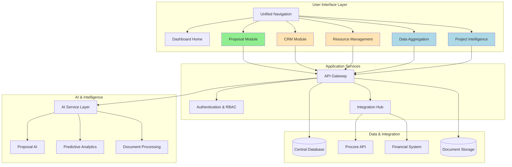

**Legend:**
- Green: Module 1 (Proposal Management)
- Orange: Module 2 (CRM & Resource Allocation)
- Blue: Module 3 (Data Aggregation & Project Intelligence)

### Module Integration Architecture

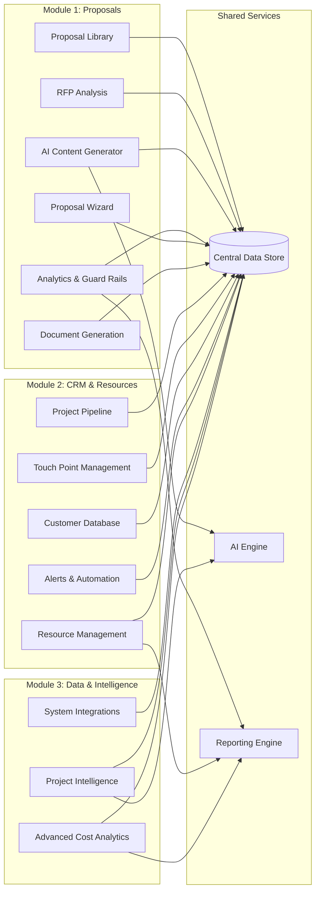

### Data Flow Across Modules

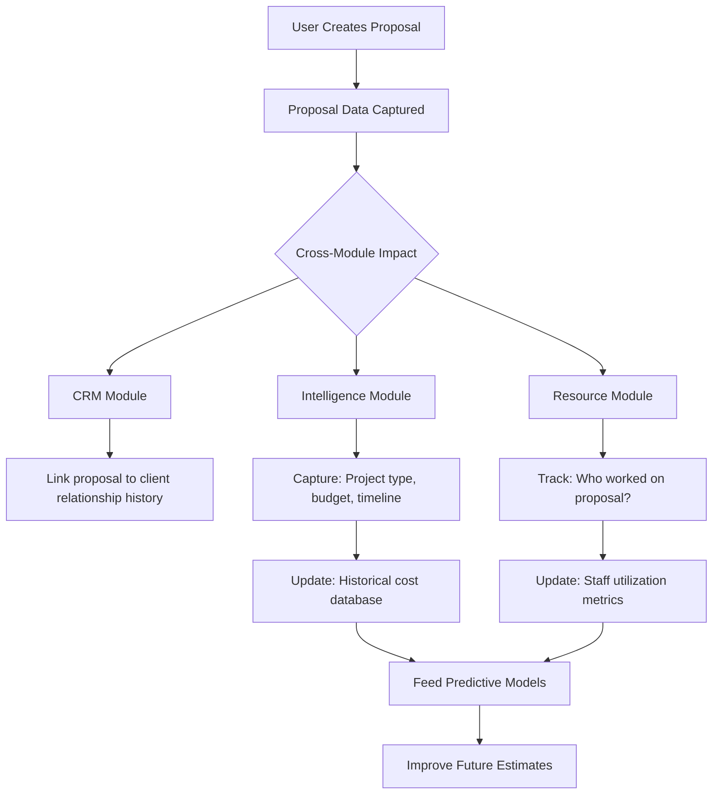

---

## Module 1: AI Assisted Proposal Management

**Duration:** ~3-4 weeks
**Investment:** $37,125

### 1.1 Proposal Library System

Upload and store proposal documents (PDF, Word) with automatic metadata extraction, full-text search capability, filtering and categorization, and preview/download functionality.

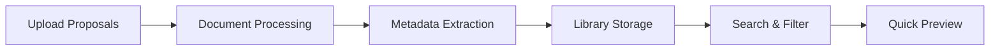

**Features:**
- Grid/list view of historical proposals
- Filter by: Project type, year, client, value range
- Full-text search functionality
- Document preview modal
- Upload new proposals (PDF, Word)
- Statistics dashboard (total proposals, categories, date ranges)

### 1.2 AI Content Generator

Integration with AI API for context-aware content generation using historical data.

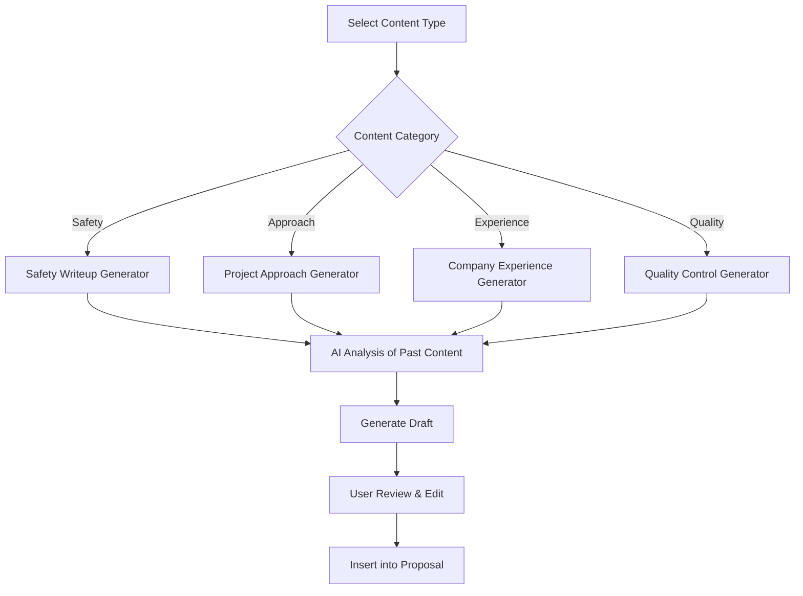

**Content Templates:**
1. Safety plans
2. Project approach
3. Company qualifications
4. Quality control procedures

**Features:**
- Context-aware generation using historical data
- Edit and refine generated content
- Save custom templates

### 1.3 RFP Analysis Tool

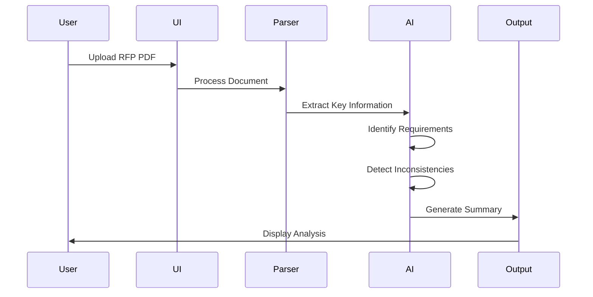

**Features:**
- Upload RFP documents
- Automatic key information extraction:
  - Project scope and requirements
  - Budget and timeline
  - Submission requirements
  - Required sections
- Inconsistency detection
- Priority ranking
- Exportable analysis summary

### 1.4 Basic Analytics Dashboard

**Features:**
- Historical project statistics
- Fee analysis by project type
- Timeline trends
- Simple visualizations
- **Estimate validation & sanity checks:**
  - Fee recommendation based on historical data
  - Warnings for unusual pricing patterns
  - Timeline reality checks
  - Comparison to similar past projects

### 1.5 Proposal Builder Wizard

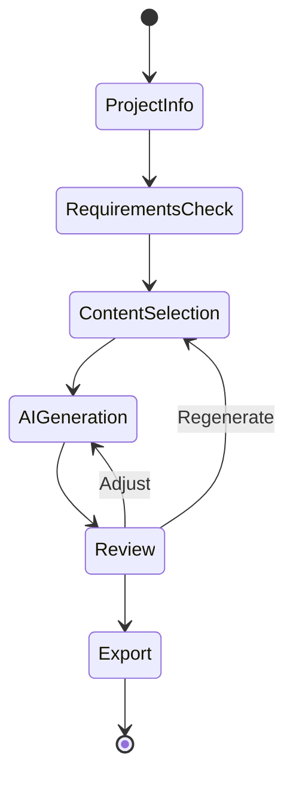

**Features:**
- Step-by-step guided workflow
- Project information collection
- Requirements checklist (auto-populated from RFP)
- Section selection and ordering
- Batch AI content generation
- Full proposal preview
- Template selection
- Export to PDF and Word

### 1.6 Estimate Validation & Guard Rails

- Prevent missing labor costs in proposals
- Flag pricing errors before submission
- Automated compliance checks (prevailing wage, LEED requirements)
- Alert if estimate significantly deviates from historical patterns
- Custom validation rules for ECI's workflow

### 1.7 Enhanced AI Features

- Fine-tuning on ECI-specific content
- Custom prompt engineering
- Multi-section coherence
- Style consistency enforcement
- Technical specification understanding
- Automatic compliance checking

### 1.8 Document Generation Engine

- Professional PDF templates
- ECI branding integration
- Dynamic table of contents
- Automatic formatting
- Image and diagram support
- Cover page customization

### 1.9 User Interface

- Responsive web application
- Professional design system
- Intuitive navigation
- Mobile-friendly

### 1.10 User Authentication

- User authentication
- Role-based access control

### 1.11 Documentation & Training

- Administrator documentation
- "Train the Trainer" & User Guides

---

## Module 2: CRM & Resource Allocation System

**Duration:** ~4-6 weeks
**Investment:** $48,375

### 2.1 Project Pipeline

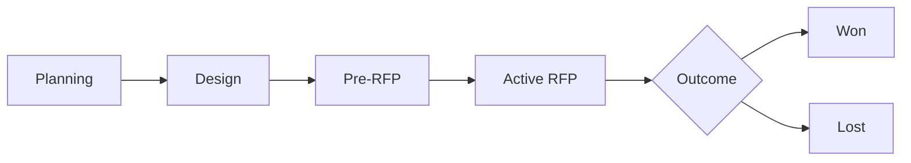

**Features:**
- Project tracking from early design through RFP
- Status workflow: Planning → Design → Pre-RFP → Active RFP → Won/Lost
- Estimated RFP date and project value tracking
- Visual pipeline dashboard (kanban or list view)
- Quick filters by status, municipality, project type, etc.

### 2.2 Touch Point Management

- Activity timeline for each project
- Log meetings, calls, emails, site visits
- Next action reminders and follow-up tracking
- Relationship strength indicators
- Key decision-maker contact database

### 2.3 Customer Database

- Customer/Cities/Counties relationship tracker
- Procurement contact management
- Historical project data
- Win rate analysis by category (i.e. municipality)
- Preferred contractor lists tracking

### 2.4 Alerts & Automation

- "Design phase starting - schedule touch-point" alerts
- "90 days until estimated RFP" notifications
- "No contact in 60 days" relationship risk warnings

### 2.5 CRM-Proposal Integration

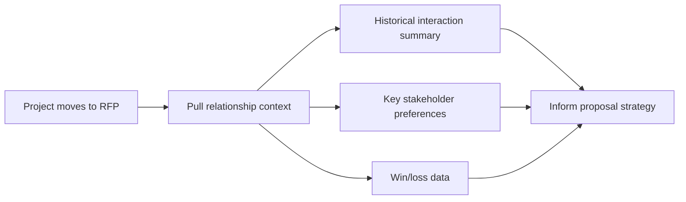

**Features:**
- When project moves to RFP, pull relationship context into proposal module
- Historical interaction summary auto-populated
- Key stakeholder preferences accessible
- Win/loss data informs proposal strategy

### 2.6 Resource Management

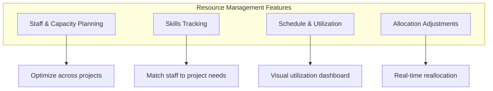

**Features:**
- Optimize staff and capacity planning across projects
- Track skills
- View schedule and utilization
- Add resources or adjust allocation

### 2.7 Documentation & Training

- Administrator documentation
- "Train the Trainer" & User Guides

---

## Module 3: Data Aggregation with Project Intelligence

**Duration:** ~2 weeks
**Investment:** $18,000

### 3.1 System Integrations

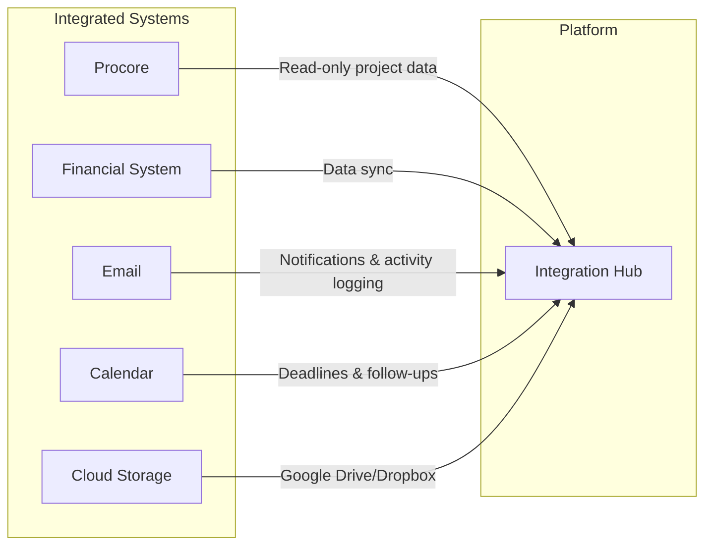

**Features:**
- Procore API integration (read-only project data)
- Financial system data sync (if feasible)
- Email integration for notifications and automated customer activity logging
- Calendar integration for deadlines and follow-up scheduling
- Cloud storage integration (Google Drive/Dropbox)

### 3.2 Performance Optimization

- Database query optimization
- Caching implementation
- Image and file optimization
- Load time improvements
- Scalability enhancements

### 3.3 Project Intelligence

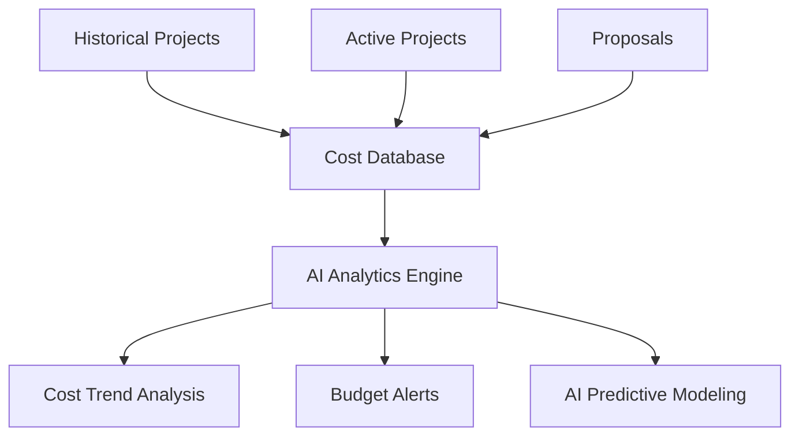

**Features:**
- AI-powered cost analysis and predictive insights
- Cost trend analysis
- Budget alerts
- AI predictive modeling

### 3.4 Advanced Cost Analytics

- Interactive dashboards
- Historical cost comparisons
- Fee recommendation engine
- Project duration predictions
- Win/loss analysis
- Custom report builder
- Data export capabilities

### 3.5 Documentation & Training

- Administrator documentation
- "Train the Trainer" & User Guides

---

## Technology Stack

### Frontend Framework
**Next.js (App Router)**
- Server components for performance
- Built-in routing
- TypeScript support
- Easy deployment to Vercel

### UI Framework
**Tailwind CSS + shadcn/ui**
- Utility-first CSS
- Consistent design system
- Pre-built accessible components
- Customizable theme

### Charts & Visualizations
**Recharts**
- React-based charts
- Responsive
- Customizable
- TypeScript support

### AI Integration
- Claude or GPT-4 API for content generation
- Custom prompt engineering for ECI-specific content
- Document parsing for RFP analysis

### Backend & Database
- PostgreSQL (Supabase/PlanetScale) for structured data
- Document storage (S3/R2) for uploaded files
- Vector store for AI-powered search

### Authentication
- NextAuth.js for user authentication
- Role-based access control

### Project Structure

```
eci-platform/
├── app/                          # Next.js App Router
│   ├── (dashboard)/             # Dashboard layout group
│   │   ├── page.tsx             # Dashboard home
│   │   ├── proposals/           # Proposal module pages
│   │   ├── crm/                 # CRM module pages
│   │   ├── resources/           # Resource management pages
│   │   ├── data/                # Data aggregation pages
│   │   └── intelligence/        # Project intelligence pages
│   ├── layout.tsx               # Root layout
│   └── globals.css              # Global styles
├── components/                   # React components
│   ├── ui/                      # shadcn components
│   ├── proposal/                # Proposal-specific components
│   ├── crm/                     # CRM components
│   ├── resources/               # Resource management components
│   └── layout/                  # Layout components
├── lib/                         # Utilities & services
│   ├── services/                # API services
│   ├── utils.ts                 # Helper functions
│   └── types.ts                 # TypeScript types
├── hooks/                       # Custom React hooks
├── contexts/                    # React Context providers
└── public/                      # Static assets
```

---

## Timeline & Milestones

### Module 1: AI Assisted Proposal Management (~3-4 Weeks)

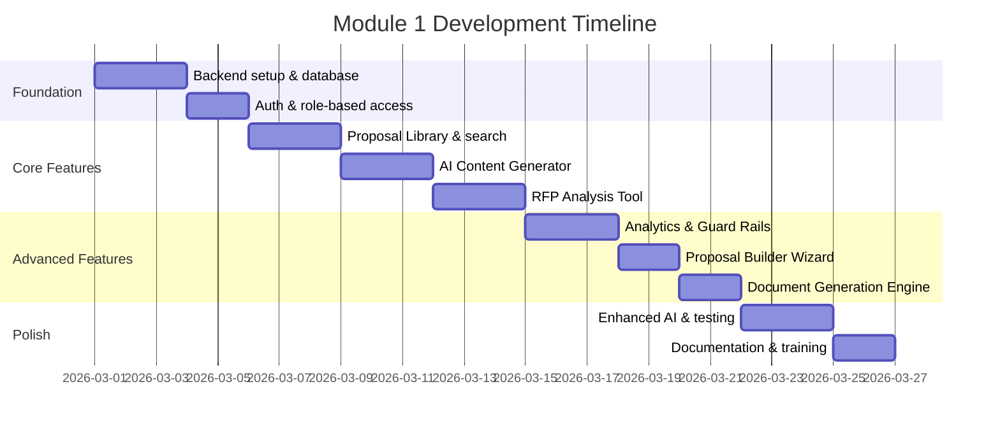

**Key Milestones:**
- Week 1: Foundation, auth, and Proposal Library functional
- Week 2: AI Content Generator and RFP Analysis complete
- Week 3: Analytics, Guard Rails, Wizard, and Document Generation
- Week 3-4: Enhanced AI features, testing, documentation

### Module 2: CRM & Resource Allocation (~4-6 Weeks)

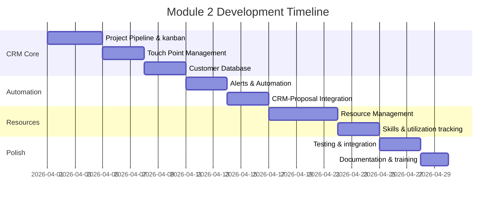

**Key Milestones:**
- Week 1-2: Pipeline, touch points, and customer database
- Week 3: Alerts, automation, and CRM-Proposal integration
- Week 4-5: Resource management and utilization tracking
- Week 5-6: Testing, integration, documentation

### Module 3: Data Aggregation with Project Intelligence (~2 Weeks)

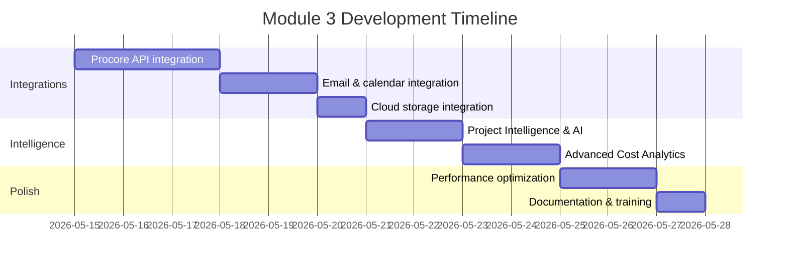

**Key Milestones:**
- Week 1: System integrations (Procore, email, calendar, cloud storage)
- Week 2: Project intelligence, cost analytics, performance optimization, documentation

**Note:** Module start dates shown above are illustrative. Actual dates depend on Client go/no-go decisions.

---

## Success Criteria

### Module 1 Success
- All proposal features fully functional (library, AI generator, RFP analysis, wizard)
- AI content generation produces ECI-specific, high-quality output
- Guard rails prevent common estimation errors
- Document generation produces professional PDFs with ECI branding
- User authentication and role-based access functional
- Executive time on proposals reduced by 80%+

### Module 2 Success
- Project pipeline provides clear visibility from design through RFP
- Touch points and relationship history are easily accessible
- Alerts proactively notify team of upcoming deadlines and relationship risks
- CRM data seamlessly feeds into proposal module
- Resource allocation and utilization clearly visible across all projects

### Module 3 Success
- Procore integration provides real-time project data
- AI-powered insights surface actionable cost trends and predictions
- Advanced analytics dashboards replace manual reporting
- System performance meets enterprise standards
- All integrations function reliably

### Overall Platform Success
- Unified platform replaces siloed manual processes
- Institutional knowledge captured and preserved
- Executive team has single-pane-of-glass visibility across the business
- Platform foundation supports future expansion

---

## Project Assumptions

**Client Responsibilities:**
- Provide access to proposal documents
- Designate project stakeholder for weekly check-ins
- Provide timely feedback on deliverables

**Technical Requirements:**
- Modern web browsers
- Internet connection
- ECI proposal documents are in standard formats (PDF, Word)
- Existing systems have documented APIs or export capabilities
