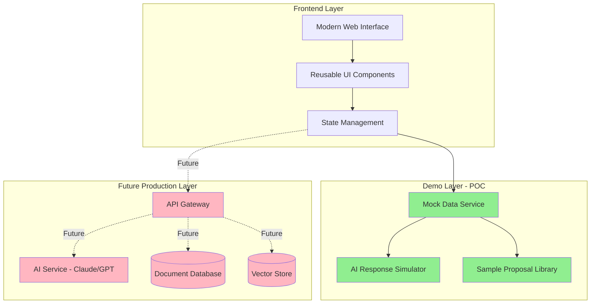
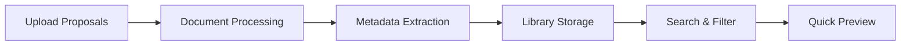
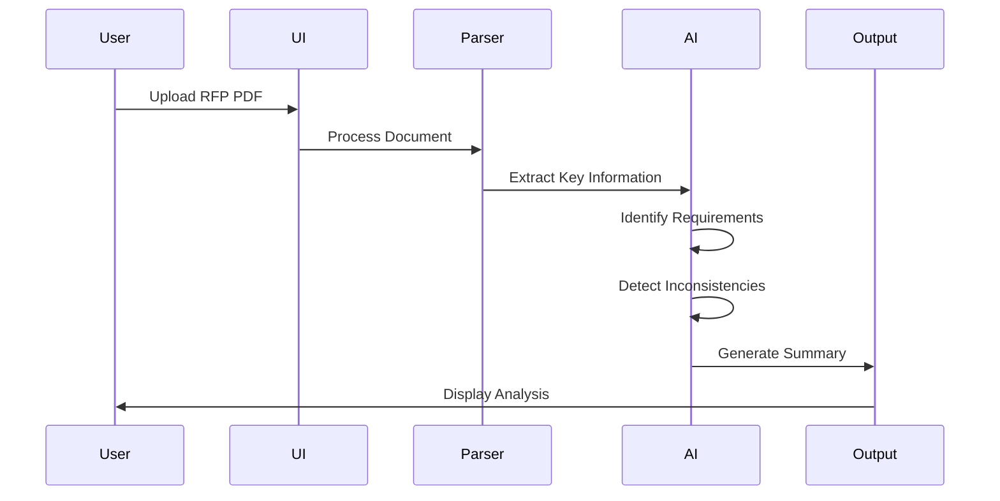
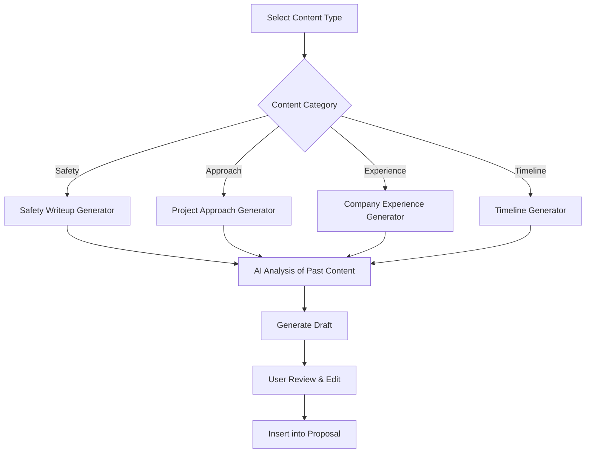
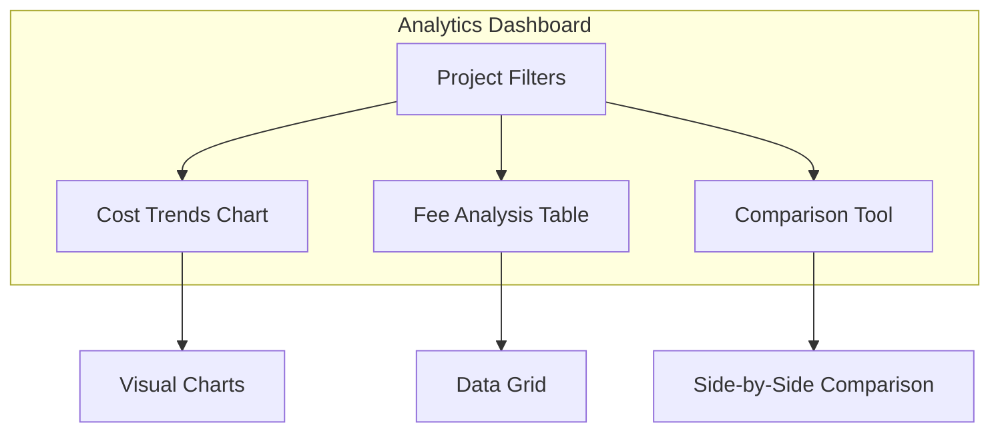
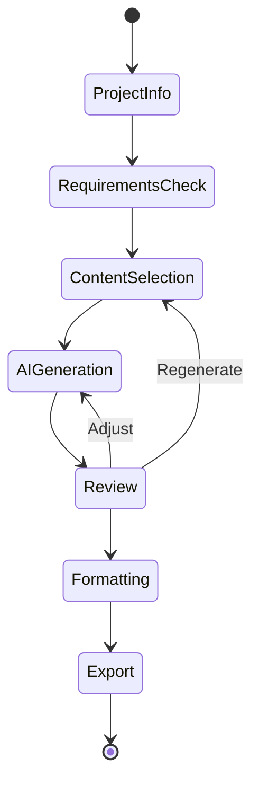
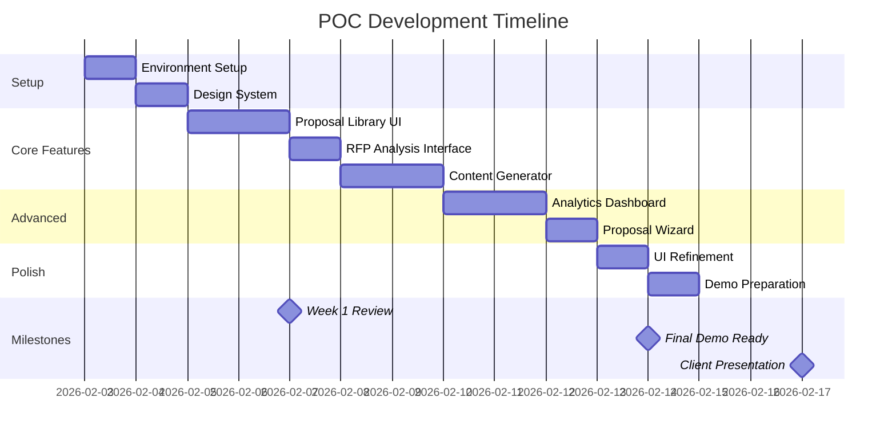

# ECI Construction - AI Proposal Manager POC Implementation Plan

**Project:** Non-Functional Proof of Concept  
**Client:** ECI Construction  
**Created:** February 3, 2026  
**Status:** Planning Phase  
**Target Completion:** February 17, 2026 (2 weeks)

---

## Table of Contents
- [Overview](#overview)
- [System Architecture](#system-architecture)
- [Feature Set](#feature-set)
- [Implementation Phases](#implementation-phases)
- [Technology Stack](#technology-stack)
- [UI/UX Design Guidelines](#uiux-design-guidelines)
- [Timeline & Milestones](#timeline--milestones)
- [Success Criteria](#success-criteria)

---

## Overview

### Objective
Build a non-functional proof of concept demonstrating the AI Proposal Manager's core capabilities using ECI Construction's historical proposal data. This POC will showcase:
- Modern, professional UI comparable to enterprise SaaS tools
- AI-powered proposal content generation
- RFP analysis and extraction
- Historical proposal search and retrieval
- Cost/fee analytics based on past projects

### Scope
**In Scope:**
- ✅ Visual prototype with working UI components
- ✅ Simulated AI responses using sample data
- ✅ Interactive demonstrations of core workflows
- ✅ Professional design system
- ✅ Sample proposal library interface
- ✅ RFP upload and analysis mockup
- ✅ Cost analytics dashboard prototype

**Out of Scope:**
- ❌ Live AI API integration
- ❌ Database implementation
- ❌ User authentication system
- ❌ Full backend development
- ❌ Production deployment infrastructure

---

## System Architecture



---

## Feature Set

### 1. Proposal Library Dashboard

**Status:** 🔵 Not Started



**Features:**
- Grid/list view of historical proposals
- Filter by: Project type, Year, Client, Value range
- Search functionality
- Document preview modal
- Upload new proposals interface
- Statistics dashboard (total proposals, categories, date ranges)

**Mock Data Required:**
- 15-20 sample proposal entries with metadata
- Project types: Recreation, Sports Complex, Aquatic Center, Playground
- Date range: 2020-2025
- Value range: $500K - $15M

---

### 2. RFP Analysis Tool

**Status:** 🔵 Not Started



**Features:**
- Drag-and-drop RFP upload
- Document processing indicator
- Key information extraction display:
  - Project scope summary
  - Budget requirements
  - Timeline/deadlines
  - Submission requirements
  - Page limits
  - Required sections
- Inconsistency highlighting
- Priority ranking of requirements
- Export analysis as PDF

**Mock Output:**
```
Project: Municipal Aquatic Center Renovation
Budget Range: $2.5M - $3.2M
Deadline: March 15, 2026
Page Limit: 25 pages (⚠️ Conflicting info: Page 3 says 30 pages)
Required Sections: Safety Plan, Project Approach, Timeline, References
Key Requirements: LEED certification, prevailing wage compliance
```

---

### 3. AI Content Generator

**Status:** 🔵 Not Started



**Features:**
- Content type selector (dropdown)
- Project context input form:
  - Project type
  - Budget range
  - Special requirements
  - Client type (municipal, private, etc.)
- "Generate Content" button
- Side-by-side editor:
  - Left: AI-generated content
  - Right: Editable version
- Copy to clipboard
- Save to library
- Regenerate option

**Sample Content Types:**
1. Safety Plan & Procedures
2. Construction Approach
3. Company Experience & Qualifications
4. Project Timeline
5. Quality Control Procedures
6. Environmental Compliance
7. Team Qualifications

---

### 4. Historical Cost Analytics

**Status:** 🔵 Not Started



**Features:**
- Interactive filters:
  - Project type
  - Year range
  - Budget range
  - Client type
- Visualizations:
  - Average fees by project size (bar chart)
  - Timeline duration trends (line chart)
  - Win rate by project type (pie chart)
- Data table with sortable columns:
  - Project name
  - Year
  - Budget
  - Fee charged
  - Fee percentage
  - Duration
- Quick stats cards:
  - Average fee percentage
  - Typical project duration
  - Most successful project type
- Export to Excel

---

### 5. Proposal Builder Wizard

**Status:** 🔵 Not Started



**Features:**
- Step-by-step wizard interface
- Progress indicator (1 of 6, 2 of 6, etc.)

**Step 1: Project Information**
- Client name
- Project type
- Budget
- Deadline
- RFP upload (optional)

**Step 2: Requirements Checklist**
- Auto-populated from RFP (if uploaded)
- Manual checklist editor
- Missing requirements warning

**Step 3: Content Selection**
- Select required sections
- Choose from templates or AI generation
- Reorder sections

**Step 4: AI Content Generation**
- Batch generate selected sections
- Progress indicator
- Preview each section

**Step 5: Review & Edit**
- Full proposal preview
- Inline editing
- Section reordering
- Add/remove sections

**Step 6: Format & Export**
- Choose template design
- Add branding (logo, colors)
- Export as PDF or Word

---

## Implementation Phases

### Phase 1: Foundation & Setup (Days 1-2)
**Status:** 🔵 Not Started

**Tasks:**
- [ ] Set up Next.js project with TypeScript
- [ ] Configure Tailwind CSS
- [ ] Install UI component library (shadcn/ui)
- [ ] Set up project structure
- [ ] Create mock data generator
- [ ] Design system setup (colors, typography, spacing)
- [ ] Create reusable component library

**Deliverables:**
- Working development environment
- Basic component library
- Mock data structure
- Design system documentation

---

### Phase 2: Core UI Development (Days 3-5)
**Status:** 🔵 Not Started

**Tasks:**
- [ ] Build navigation layout
- [ ] Create dashboard homepage
- [ ] Implement Proposal Library view
  - [ ] Grid/list toggle
  - [ ] Filter sidebar
  - [ ] Search bar
  - [ ] Proposal cards
  - [ ] Detail modal
- [ ] Build RFP upload interface
- [ ] Create analysis results display
- [ ] Develop content generator form

**Deliverables:**
- Functional navigation
- Interactive proposal library
- Upload interface
- Content generation UI

---

### Phase 3: Advanced Features (Days 6-8)
**Status:** 🔵 Not Started

**Tasks:**
- [ ] Build cost analytics dashboard
  - [ ] Filter controls
  - [ ] Chart components (using Chart.js or Recharts)
  - [ ] Data table
  - [ ] Statistics cards
- [ ] Create proposal builder wizard
  - [ ] Multi-step form
  - [ ] Progress tracking
  - [ ] Section editor
- [ ] Implement preview/export functionality
- [ ] Add sample data integration

**Deliverables:**
- Working analytics dashboard
- Proposal wizard flow
- Preview system
- Export mockup

---

### Phase 4: Polish & Demo Prep (Days 9-10)
**Status:** 🔵 Not Started

**Tasks:**
- [ ] Refine all animations and transitions
- [ ] Add loading states and skeletons
- [ ] Implement error states and empty states
- [ ] Optimize mobile responsiveness
- [ ] Create demo script
- [ ] Prepare sample scenarios
- [ ] Record demo video (optional)
- [ ] Create presentation deck

**Deliverables:**
- Polished UI with smooth interactions
- Demo-ready application
- Presentation materials
- User guide documentation

---

## Technology Stack

### Frontend Framework
**Next.js 14+ (App Router)**
- Server components for performance
- Built-in routing
- TypeScript support
- Easy deployment

### UI Framework
**Tailwind CSS + shadcn/ui**
- Utility-first CSS
- Consistent design system
- Pre-built accessible components
- Customizable theme

### Component Library
**shadcn/ui Components:**
- Button, Card, Dialog, Dropdown
- Form inputs, Select, Checkbox
- Table, Tabs, Toast notifications
- Sheet, Skeleton, Progress

### Icons
**Lucide React**
- Consistent icon set
- Tree-shakeable
- Customizable

### Charts & Visualizations
**Recharts**
- React-based charts
- Responsive
- Customizable
- Good TypeScript support

### Mock Data
**Faker.js**
- Generate realistic sample data
- Consistent test data

### File Handling (UI Only)
**React Dropzone**
- Drag-and-drop upload
- File type validation
- Preview support

---

## UI/UX Design Guidelines

### Design Principles

**1. Professional & Clean**
- Inspired by modern SaaS tools (Linear, Notion, Vercel)
- Generous white space
- Clear visual hierarchy
- Consistent spacing system

**2. Accessible**
- WCAG 2.1 AA compliance
- Keyboard navigation
- Screen reader support
- High contrast ratios

**3. Responsive**
- Mobile-first approach
- Breakpoints: 640px, 768px, 1024px, 1280px
- Touch-friendly targets (min 44px)

### Color Palette

```css
/* Primary */
--primary: 240 5.9% 10%        /* Dark slate */
--primary-foreground: 0 0% 98% /* Off white */

/* Secondary */
--secondary: 240 4.8% 95.9%    /* Light gray */
--secondary-foreground: 240 5.9% 10%

/* Accent */
--accent: 217 91% 60%          /* Blue */
--accent-foreground: 0 0% 100%

/* Destructive */
--destructive: 0 84% 60%       /* Red */
--destructive-foreground: 0 0% 98%

/* Success */
--success: 142 76% 36%         /* Green */

/* Warning */
--warning: 38 92% 50%          /* Orange */
```

### Typography

```css
/* Font Family */
--font-sans: 'Inter', system-ui, sans-serif
--font-mono: 'JetBrains Mono', monospace

/* Font Sizes */
--text-xs: 0.75rem    /* 12px */
--text-sm: 0.875rem   /* 14px */
--text-base: 1rem     /* 16px */
--text-lg: 1.125rem   /* 18px */
--text-xl: 1.25rem    /* 20px */
--text-2xl: 1.5rem    /* 24px */
--text-3xl: 1.875rem  /* 30px */
--text-4xl: 2.25rem   /* 36px */
```

### Spacing System

Based on 4px base unit:
- xs: 4px
- sm: 8px
- md: 16px
- lg: 24px
- xl: 32px
- 2xl: 48px
- 3xl: 64px

### Component Patterns

**Cards:**
```tsx
<Card className="border border-gray-200 rounded-lg shadow-sm hover:shadow-md transition-shadow">
  <CardHeader>
    <CardTitle>Title</CardTitle>
    <CardDescription>Description</CardDescription>
  </CardHeader>
  <CardContent>
    {/* Content */}
  </CardContent>
  <CardFooter>
    {/* Actions */}
  </CardFooter>
</Card>
```

**Buttons:**
- Primary: Solid background, high contrast
- Secondary: Outlined, lower visual weight
- Ghost: Minimal styling, for tertiary actions
- Destructive: Red, for delete/cancel actions

**Forms:**
- Clear labels above inputs
- Helper text below inputs
- Inline validation messages
- Disabled states clearly indicated

---

## Timeline & Milestones



### Key Milestones

**Milestone 1: Week 1 Review (Feb 7)**
- ✅ Core UI components built
- ✅ Proposal library functional
- ✅ RFP upload interface complete

**Milestone 2: Demo Ready (Feb 14)**
- ✅ All features implemented
- ✅ Mock data integrated
- ✅ UI polished and responsive

**Milestone 3: Client Presentation (Feb 17)**
- ✅ Demo rehearsed
- ✅ Presentation materials ready
- ✅ Feedback collection plan

---

## Success Criteria

### Technical Success
- [ ] All UI components render correctly across modern browsers
- [ ] Mobile responsive on screens 375px and up
- [ ] No console errors or warnings
- [ ] Smooth animations (60fps)
- [ ] Fast load times (<2s initial load)

### Design Success
- [ ] Matches reference quality (enterprise SaaS level)
- [ ] Consistent design system applied throughout
- [ ] Accessible (keyboard nav, screen readers)
- [ ] Professional color scheme and typography

### Demo Success
- [ ] Can demonstrate all 5 core features
- [ ] Sample data is realistic and relevant to ECI
- [ ] User flows are intuitive
- [ ] Simulated AI responses are convincing
- [ ] Client can visualize production version

### Business Success
- [ ] Ted Johnson and team are impressed
- [ ] Clear differentiation from off-the-shelf solutions
- [ ] Cost/value proposition is evident
- [ ] Team is eager to move to Phase 2 (production build)

---

## Risk Management

### Risks & Mitigation

| Risk | Impact | Probability | Mitigation |
|------|--------|-------------|------------|
| Timeline slippage | High | Medium | Build MVP first, add polish incrementally |
| Overly complex features | Medium | Medium | Focus on visual demo, not full functionality |
| Design quality below expectations | High | Low | Use proven component library, follow best practices |
| Mock data not realistic enough | Medium | Medium | Work closely with ECI to get real sample data |
| Technical difficulties | Medium | Low | Use well-tested tech stack, avoid bleeding edge |

---

## Next Steps

### Immediate Actions (This Week)
1. ✅ Get approval on implementation plan
2. ⬜ Set up development environment
3. ⬜ Create initial project structure
4. ⬜ Build design system and component library
5. ⬜ Request sample proposal documents from ECI

### Week 2 Actions
1. ⬜ Build core UI features
2. ⬜ Integrate mock data
3. ⬜ Conduct internal review
4. ⬜ Iterate based on feedback

### Week 3 Actions
1. ⬜ Final polish and optimization
2. ⬜ Prepare demo materials
3. ⬜ Present to ECI
4. ⬜ Collect feedback for production roadmap

---

## Appendix

### Sample Data Structure

```typescript
interface Proposal {
  id: string;
  title: string;
  client: string;
  projectType: 'Recreation' | 'Sports Complex' | 'Aquatic' | 'Playground';
  budget: number;
  submissionDate: Date;
  status: 'Won' | 'Lost' | 'Pending';
  fee: number;
  feePercentage: number;
  duration: number; // months
  fileUrl: string;
  tags: string[];
}

interface RFPAnalysis {
  projectName: string;
  budgetRange: { min: number; max: number };
  deadline: Date;
  pageLimit: number;
  inconsistencies: string[];
  requiredSections: string[];
  keyRequirements: string[];
  priorityLevel: 'High' | 'Medium' | 'Low';
}
```

---

**Document Status:** Living Document - Updated during implementation  
**Last Updated:** February 3, 2026  
**Next Review:** February 7, 2026
