# ECI Construction - Unified Business Intelligence Platform POC

**Project:** Phase 1 - AI Proposal Manager (Non-Functional Proof of Concept)  
**Client:** ECI Construction  
**Created:** February 3, 2026  
**Status:** Planning Phase  
**Target Completion:** February 17, 2026 (2 weeks)

---

## Table of Contents
- [Strategic Vision](#strategic-vision)
- [Overview](#overview)
- [System Architecture](#system-architecture)
- [Feature Set](#feature-set)
- [Implementation Phases](#implementation-phases)
- [Technology Stack](#technology-stack)
- [UI/UX Design Guidelines](#uiux-design-guidelines)
- [Timeline & Milestones](#timeline--milestones)
- [Success Criteria](#success-criteria)

---

## Strategic Vision

### ECI's Complete Business Challenges & Platform Roadmap

During our meeting and follow-up email, Ted identified **five critical areas** that this platform will address:

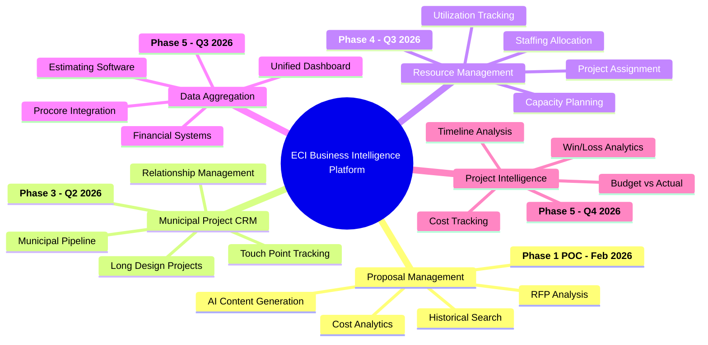

### Ted's Email Follow-Up (Critical Addition):

> "Frankly – we should also think about a simple CRM platform – we don't need anything crazy there either. Again, most of our work is municipal, gets advertised, etc. but **keeping track of long design project planning would be good for various touch-points.**"

**Why This Matters:**
- Municipal projects have long planning cycles (12-36+ months before RFP)
- Multiple stakeholders require relationship management
- Touch-point tracking ensures ECI stays top-of-mind
- Early involvement in design phase = competitive advantage
- **Natural integration with proposal module** - when project goes to RFP, historical relationship context informs proposal

### Why Start with Proposals?

**Immediate ROI:**
- Ted spends 15+ hours/week on proposals (60 hrs/month)
- CEO-level time valued at $200/hr = $12,000/month waste
- 80% time reduction = **$115,200/year savings**
- Fastest path to demonstrating AI value

**Foundation for Expansion:**
- Proposal data contains project types, budgets, timelines, resources
- Natural bridge to resource allocation (who worked on what)
- Historical cost data feeds into estimating and analytics
- Common UI/UX patterns reusable across modules

**Institutional Knowledge Preservation:**
- Captures Ted's 20+ years of recreation construction expertise
- Preserves "tribal knowledge" for succession planning
- Ensures consistency even as team members change
- Protects against knowledge loss (estimated $100K+ value)
- **Ted's pain point:** "90% of proposal content already exists but takes hours to locate"

**Strategic Positioning:**
- Differentiates from off-the-shelf proposal tools (Shred.ai, Unanet, Responsive)
- Demonstrates custom platform capability
- Shows integration potential with existing systems (Procore, financial software)
- Validates AI approach before tackling more complex modules

---

## Overview

### POC Phase 1 Objective
Build a non-functional proof of concept demonstrating the **AI Proposal Manager** module as the first component of ECI's unified business intelligence platform. This POC will showcase:

**Primary Features (Proposal Management):**
- Modern, professional UI comparable to enterprise SaaS tools
- AI-powered proposal content generation
- RFP analysis and extraction
- Historical proposal search and retrieval
- Cost/fee analytics based on past projects

**Platform Vision Preview (Future Modules):**
- **Municipal Project CRM**: Track long design project planning, touch-points, municipal pipeline
- **Resource Management**: Staffing allocation, project assignment, capacity planning
- **Data Aggregation**: Unified dashboard integrating Procore, financial systems, estimating software
- **Project Intelligence**: Cost tracking, budget analysis, win/loss analytics
- Navigation structure showing all 5 modules with consistent design system

### Scope
**In Scope for POC:**
- ✅ Visual prototype with working UI components
- ✅ Simulated AI responses using sample data
- ✅ Interactive demonstrations of proposal workflows
- ✅ Professional design system for entire platform
- ✅ Sample proposal library interface
- ✅ RFP upload and analysis mockup
- ✅ Cost analytics dashboard prototype
- ✅ Navigation showing full platform vision (5 modules)
- ✅ Preview mockups of future modules (CRM, staffing, data aggregation, project intelligence)

**Out of Scope:**
- ❌ Live AI API integration
- ❌ Database implementation
- ❌ User authentication system
- ❌ Full backend development
- ❌ Production deployment infrastructure
- ❌ Actual system integrations (Procore, financial software)

---

## System Architecture

### Platform-Wide Architecture Vision

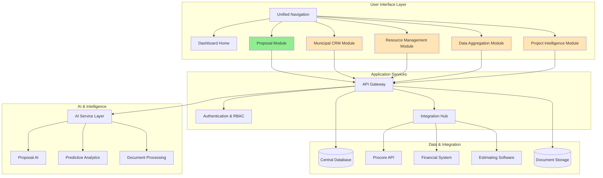

**Legend:**
- 🟢 Green: Phase 1 POC (Proposals) - Feb 2026
- 🟡 Orange: Future Phases - Q2-Q4 2026

### POC Architecture (Phase 1 Focus)

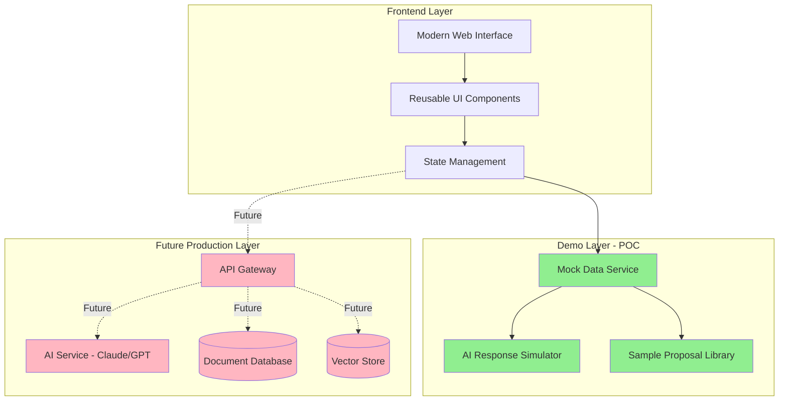

### Module Integration Architecture (Full Platform)

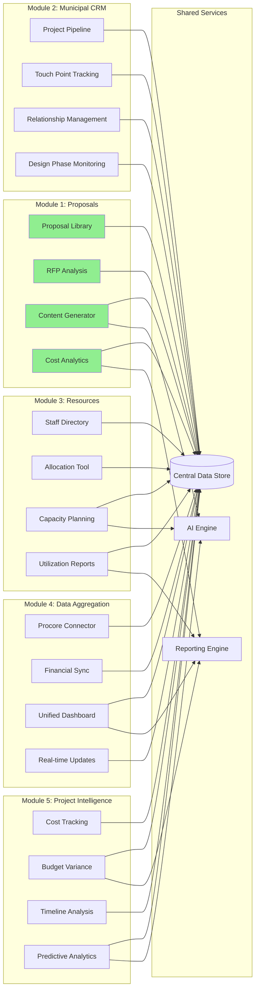

### Data Flow Across Modules

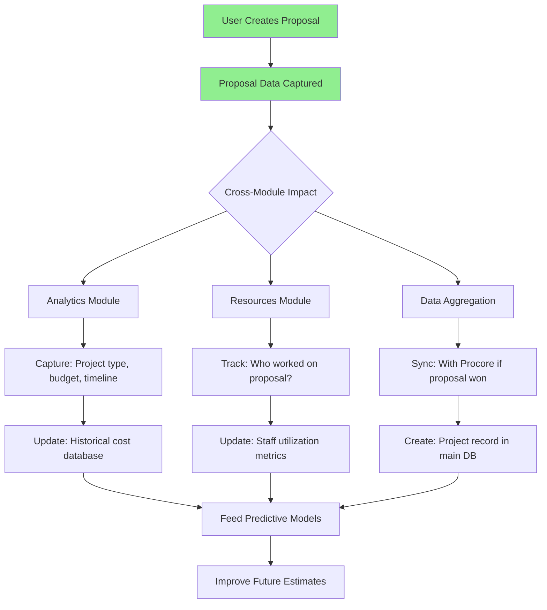

---

## Detailed Technical Architecture

### Component Architecture

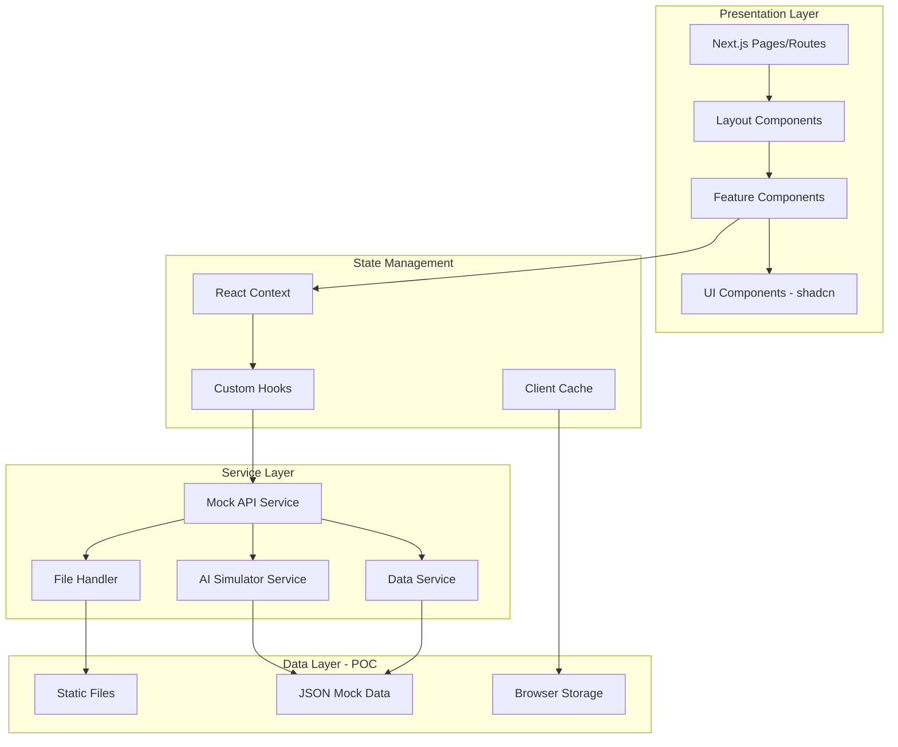

### Data Flow Architecture

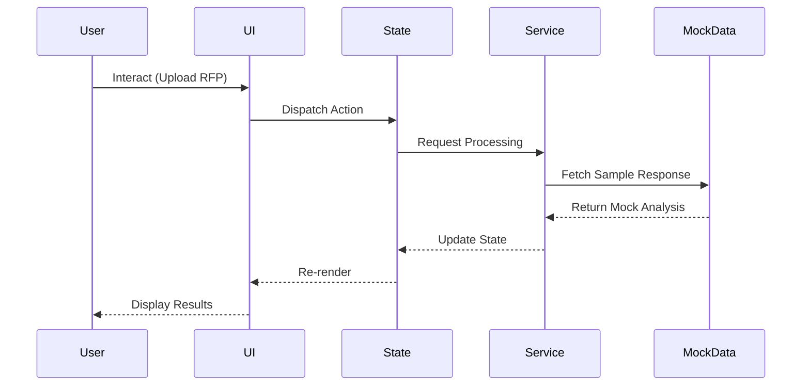

### Frontend Component Hierarchy

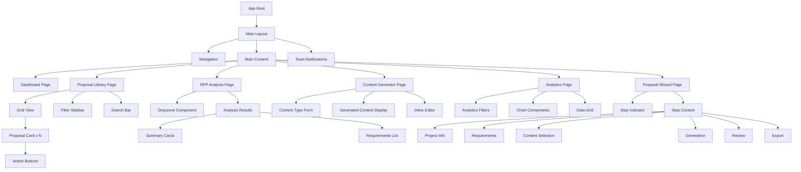

### Data Model (Mock Data Structure)

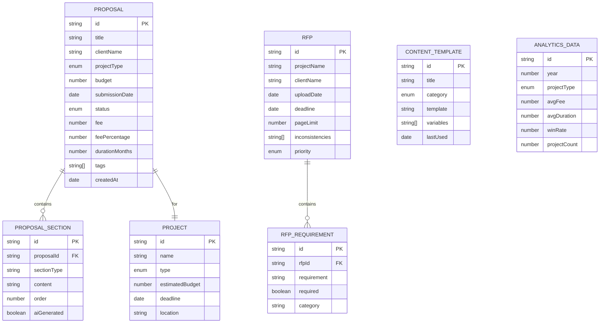

### State Management Pattern

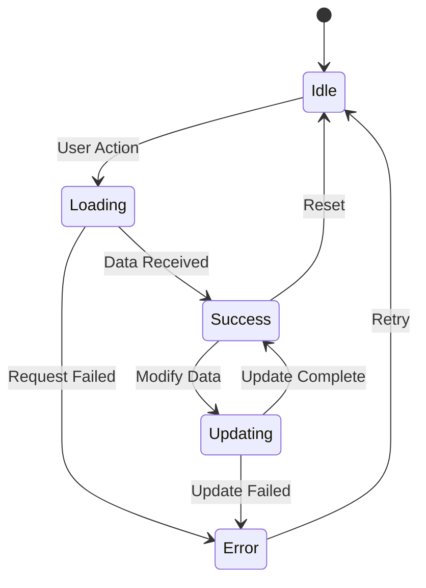

### File Processing Flow (POC - Simulated)

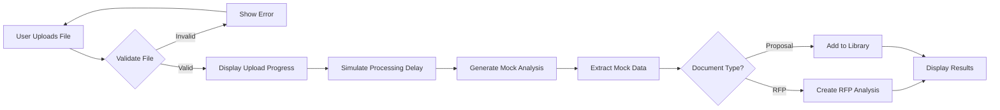

### Security Architecture (Future Production)

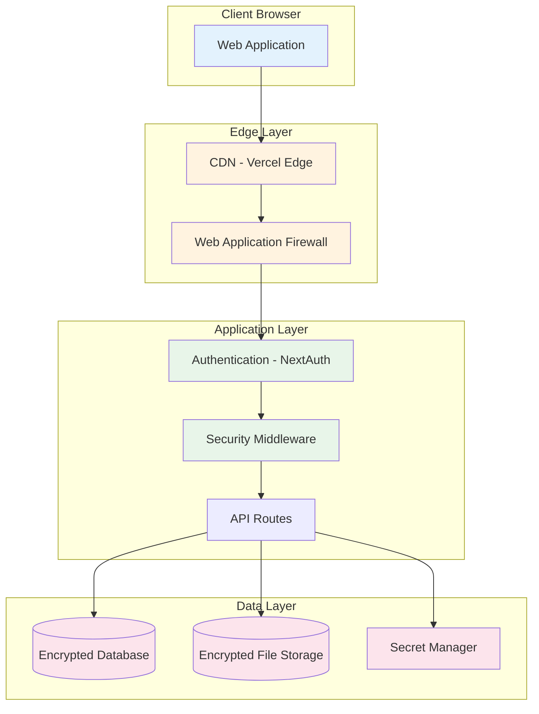

### Deployment Architecture (Future Production)

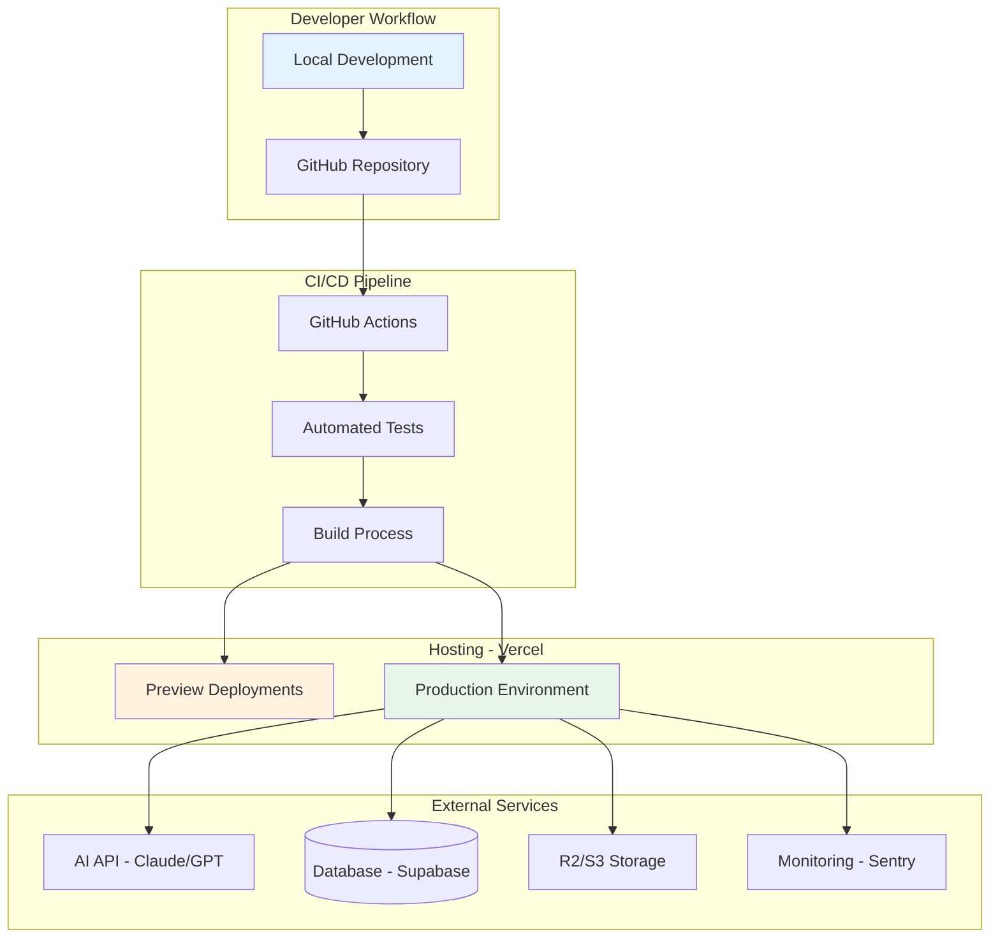

### API Design (Future Production Reference)

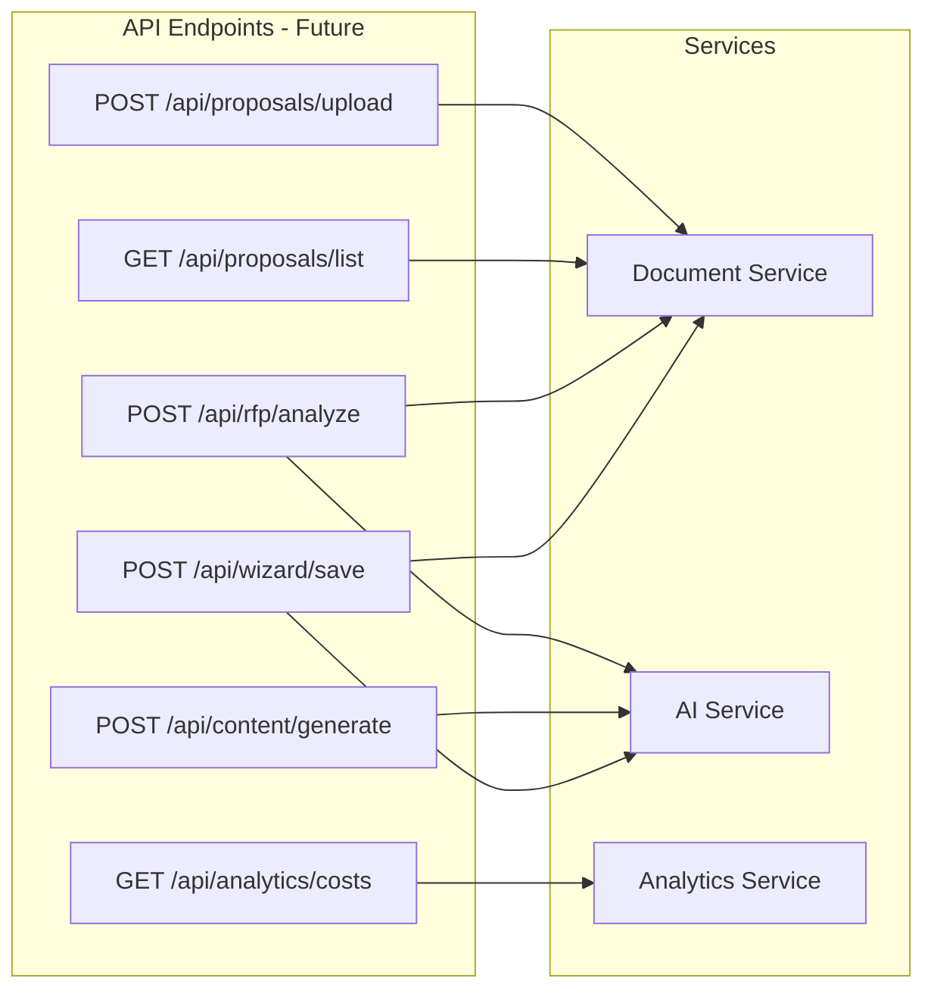

---

## Feature Set

### Phase 1 Features (POC - Fully Functional UI)

#### 1. Proposal Library Dashboard

**Status:** 🔵 Not Started  
**Priority:** P0 - Critical

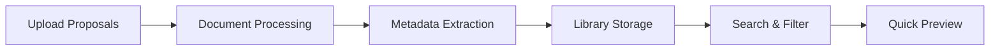

**Features:**
- Grid/list view of historical proposals
- Filter by: Project type, Year, Client, Value range
- Search functionality
- Document preview modal
- Upload new proposals interface
- Statistics dashboard (total proposals, categories, date ranges)

**Mock Data Required:**
- 15-20 sample proposal entries with metadata
- Project types: Recreation, Sports Complex, Aquatic Center, Playground
- Date range: 2020-2025
- Value range: $500K - $15M

---

#### 2. RFP Analysis Tool

**Status:** 🔵 Not Started

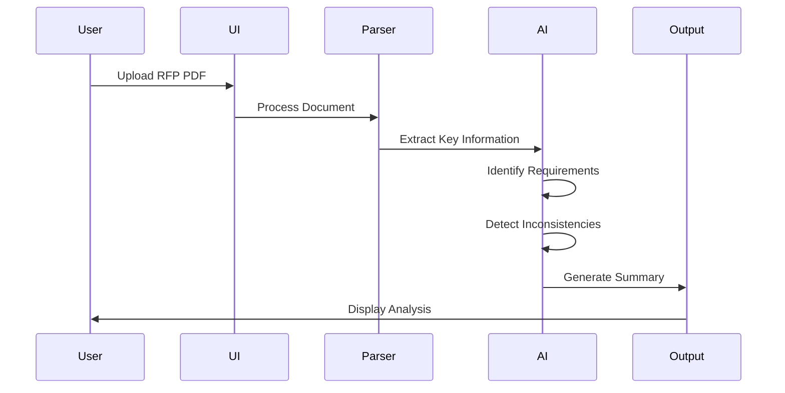

**Features:**
- Drag-and-drop RFP upload
- Document processing indicator
- Key information extraction display:
  - Project scope summary
  - Budget requirements
  - Timeline/deadlines
  - Submission requirements
  - Page limits
  - Required sections
- Inconsistency highlighting
- Priority ranking of requirements
- Export analysis as PDF

**Mock Output:**
```
Project: Municipal Aquatic Center Renovation
Budget Range: $2.5M - $3.2M
Deadline: March 15, 2026
Page Limit: 25 pages (⚠️ Conflicting info: Page 3 says 30 pages)
Required Sections: Safety Plan, Project Approach, Timeline, References
Key Requirements: LEED certification, prevailing wage compliance
```

---

### 3. AI Content Generator

**Status:** 🔵 Not Started

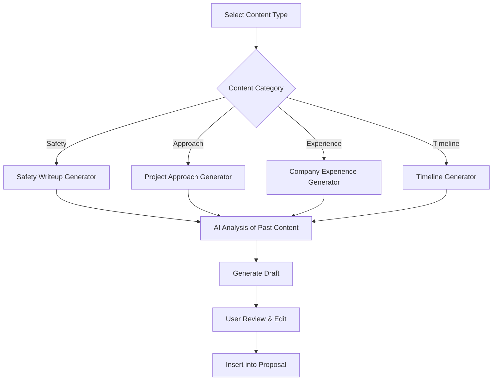

**Features:**
- Content type selector (dropdown)
- Project context input form:
  - Project type
  - Budget range
  - Special requirements
  - Client type (municipal, private, etc.)
- "Generate Content" button
- Side-by-side editor:
  - Left: AI-generated content
  - Right: Editable version
- Copy to clipboard
- Save to library
- Regenerate option

**Sample Content Types:**
1. Safety Plan & Procedures
2. Construction Approach
3. Company Experience & Qualifications
4. Project Timeline
5. Quality Control Procedures
6. Environmental Compliance
7. Team Qualifications

---

### 4. Historical Cost Analytics

**Status:** 🔵 Not Started

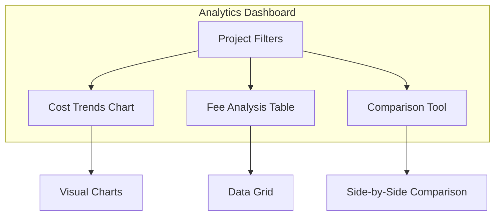

**Features:**
- Interactive filters:
  - Project type
  - Year range
  - Budget range
  - Client type
- Visualizations:
  - Average fees by project size (bar chart)
  - Timeline duration trends (line chart)
  - Win rate by project type (pie chart)
- Data table with sortable columns:
  - Project name
  - Year
  - Budget
  - Fee charged
  - Fee percentage
  - Duration
- Quick stats cards:
  - Average fee percentage
  - Typical project duration
  - Most successful project type
- **Estimate Validation (Preview in POC):**
  - Fee recommendation based on historical data
  - Warning if fee % is significantly below historical average
  - Alert if project duration estimate seems unrealistic
  - "Sanity check" comparison to similar projects
- Export to Excel

---

### 5. Proposal Builder Wizard

**Status:** 🔵 Not Started

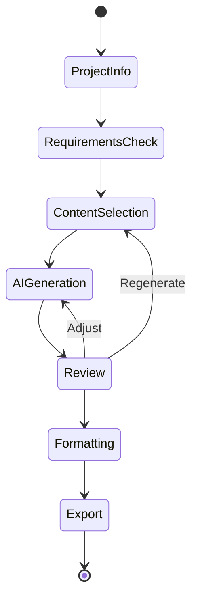

**Features:**
- Step-by-step wizard interface
- Progress indicator (1 of 6, 2 of 6, etc.)

**Step 1: Project Information**
- Client name
- Project type
- Budget
- Deadline
- RFP upload (optional)

**Step 2: Requirements Checklist**
- Auto-populated from RFP (if uploaded)
- Manual checklist editor
- Missing requirements warning

**Step 3: Content Selection**
- Select required sections
- Choose from templates or AI generation
- Reorder sections

**Step 4: AI Content Generation**
- Batch generate selected sections
- Progress indicator
- Preview each section

**Step 5: Review & Edit**
- Full proposal preview
- Inline editing
- Section reordering
- Add/remove sections

**Step 6: Format & Export**
- Choose template design
- Add branding (logo, colors)
- Export as PDF or Word

---

### Future Module Previews (Visual Mockups Only in POC)

#### 6. Municipal Project CRM (Phase 2A Preview)

**Status:** 🟡 Future - Mockup Only  
**Referenced in Email:** Ted's follow-up requirement

**Ted's Exact Request:**
> "Frankly – we should also think about a simple CRM platform – we don't need anything crazy there either. Again, most of our work is municipal, gets advertised, etc. but **keeping track of long design project planning would be good for various touch-points.**"

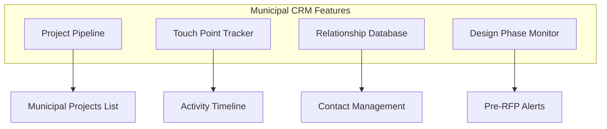

**Preview Features to Mockup:**
- **Pipeline Dashboard**: Track projects from early design through RFP
  - Project status: Planning, Design, Pre-RFP, Active RFP, Won, Lost
  - Estimated RFP date and project value
  - Last contact date and next follow-up reminder
- **Touch Point History**: Timeline of all interactions
  - Meetings, calls, emails, site visits
  - Relationship strength indicators
  - Key decision-makers and their preferences
- **Municipal Database**: 
  - Cities/counties ECI works with
  - Procurement contacts
  - Historical relationship data
  - Past project success rates by municipality
- **Alerts & Reminders**:
  - "City of X design phase starting - schedule touch-point"
  - "90 days until estimated RFP - prepare proposal team"
  - "No contact in 60 days - relationship at risk"

**Why This Matters for Municipal Work:**
- Long design cycles (12-36 months) require consistent relationship management
- Early involvement = competitive advantage when RFP drops
- Track which municipalities favor ECI vs. competitors
- **Seamless integration with Proposal Module**: When project goes to RFP, all relationship context automatically available

**Connection to Other Modules:**
- CRM → Proposals: Historical relationship informs proposal strategy
- CRM → Resources: Identify staff with municipality relationships
- CRM → Project Intelligence: Win/loss analysis by municipality

---

#### 7. Resource Allocation Dashboard (Phase 2B Preview)

**Status:** 🟡 Future - Mockup Only  
**Referenced in Meeting:** Demonstrated via consulting firm project management tool

```mermaid
graph TB
    subgraph "Resource Management Features"
        A[Staff Directory]
        B[Project Assignment]
        C[Capacity Planning]
        D[Utilization Dashboard]
    end
    
    A --> E[Visual Staff Cards]
    B --> F[Drag & Drop Allocation]
    C --> G[Hiring Forecast]
    D --> H[Utilization Charts]
```

**Preview Features to Mockup:**
- Staff directory with photos and roles
- Project allocation grid showing:
  - Who is assigned to which projects
  - Percentage allocation per project
  - Available capacity per person
  - Overallocation warnings
- Visual utilization trends (similar to consulting firm demo)
- Quick stats: Total staff, avg utilization, open capacity
- Integration point with proposal data (show staff used on past proposals)

**Ted's Pain Point:**
> "We manually do staffing allocation in Excel... it's mom and pop versus being a little more refined in having a tool that does this."

**Connection to Proposals:**
- When proposal is won → automatically suggest team based on similar past projects
- Historical data shows which staff worked on similar projects
- Capacity planning informs whether ECI can take on new work

---

#### 8. Data Aggregation Dashboard (Phase 3 Preview)

**Status:** 🟡 Future - Mockup Only  
**Ted's Challenge:** "We have so many systems... they're kind of working in silos"

```mermaid
graph LR
    subgraph "Integrated Systems"
        P[Procore Projects]
        F[Financial Data]
        E[Estimating Software]
        PP[Proposal Platform]
    end
    
    subgraph "Unified View"
        D[Executive Dashboard]
    end
    
    P --> D
    F --> D
    E --> D
    PP --> D
    
    D --> S1[Project Snapshot]
    D --> S2[Financial Health]
    D --> S3[Pipeline Status]
```

**Preview Features to Mockup:**
- Executive dashboard showing:
  - All active projects from Procore
  - Budget vs actual from financial system
  - Proposal pipeline status
  - Staff allocation overview
  - Cash flow projection
- "Snapshot" view Ted mentioned: "I can't just go to one place and have a dashboard that tells me everything"
- Mobile-friendly view (Ted mentioned needing access in truck)
- Integration status indicators showing which systems are connected

**Mock Data Points:**
- 8-10 active projects
- Budget vs actual variance
- 5-6 proposals in pipeline
- Staff utilization summary
- Revenue projection chart

---

#### 9. Project Cost Intelligence (Phase 4 Preview)

**Status:** 🟡 Future - Mockup Only  
**Ted's Need:** "Building projections manually... what falls off when... different people in different systems"

```mermaid
graph TB
    A[Historical Projects] --> B[Cost Database]
    C[Active Projects] --> B
    D[Proposals] --> B
    
    B --> E[Analytics Engine]
    
    E --> F[Cost Trends]
    E --> G[Budget Variance]
    E --> H[Predictive Models]
    E --> I[Fee Optimization]
```

**Preview Features to Mockup:**
- Historical cost analytics (already in proposals module, expanded here)
- Budget vs actual tracking for active projects
- Project profitability analysis
- **Estimate Guard Rails & Validation:**
  - Prevent missing labor costs in proposals
  - Flag pricing errors before submission
  - Automated checks: "Did you include prevailing wage?"
  - Alert if estimate significantly deviates from historical patterns
  - **Custom validation rules** specific to ECI's recreation construction workflow
- Fee recommendation engine:
  - Input: Project type, budget range
  - Output: Recommended fee % based on historical data
  - Comparison: "Similar projects averaged 11.2% fee"
- Timeline prediction based on past projects
- Risk indicators (projects trending over budget)

**Ted's Quote:**
> "For $1M to $5M projects, what were our average fees, average time? We could manually enter all that stuff, but there's a better way."

**Custom Solution Advantage:**
- Off-the-shelf tools lack industry-specific validation rules
- ECI-specific guard rails prevent costly estimation errors
- Tailored to recreation construction unique requirements (LEED, prevailing wage, safety compliance)

**Connection to Other Modules:**
- Uses proposal data for historical fees
- Integrates with Procore for active project costs
- Informs resource allocation (profitable projects get priority)

---

### Platform Navigation Preview

**POC Will Include:**
- Full navigation sidebar showing all modules (even if not built yet)
- Dashboard home page with:
  - Module cards for each of the 4 major areas
  - "Coming Soon" badges on future modules
  - Quick access to Phase 1 proposal features
- Breadcrumb navigation
- User profile menu (mockup only)

**Navigation Structure:**
```
🏠 Dashboard Home
📄 Proposals
   ├─ Library
   ├─ RFP Analysis
   ├─ Content Generator
   ├─ Analytics
   └─ New Proposal Wizard
   
👥 Resources (Coming Soon)
   ├─ Staff Directory
   ├─ Project Allocation
   ├─ Capacity Planning
   └─ Utilization Reports
   
🔗 Data Hub (Coming Soon)
   ├─ Executive Dashboard
   ├─ Procore Integration
   ├─ Financial Integration
   └─ System Settings
   
📊 Project Intelligence (Coming Soon)
   ├─ Cost Tracking
   ├─ Budget Analysis
   ├─ Timeline Insights
   └─ Predictive Analytics
   
⚙️ Settings
   ├─ Profile
   ├─ Integrations
   └─ Preferences
```

---

## Implementation Phases

### Phase 1: Foundation & Platform Setup (Days 1-2)
**Status:** 🔵 Not Started

**Tasks:**
- [ ] Set up Next.js project with TypeScript
- [ ] Configure Tailwind CSS
- [ ] Install UI component library (shadcn/ui)
- [ ] Set up project structure for multi-module platform
- [ ] Create mock data generator for all modules
- [ ] Design system setup (colors, typography, spacing)
- [ ] Create reusable component library
- [ ] Build platform navigation structure
- [ ] Create dashboard home page with module cards

**Deliverables:**
- Working development environment
- Basic component library
- Mock data structure for proposals + future modules
- Design system documentation
- Platform navigation skeleton

---

### Phase 2: Core Proposal Features (Days 3-5)
**Status:** 🔵 Not Started

**Tasks:**
- [ ] Implement Proposal Library view
  - [ ] Grid/list toggle
  - [ ] Filter sidebar
  - [ ] Search bar
  - [ ] Proposal cards
  - [ ] Detail modal
- [ ] Build RFP upload interface
- [ ] Create analysis results display
- [ ] Develop content generator form
- [ ] Integrate simulated AI responses

**Deliverables:**
- Functional navigation
- Interactive proposal library
- Upload interface
- Content generation UI
- Working demo flow for proposal creation

---

### Phase 3: Analytics & Future Module Previews (Days 6-8)
**Status:** 🔵 Not Started

**Tasks:**
- [ ] Build cost analytics dashboard (fully functional)
  - [ ] Filter controls
  - [ ] Chart components (using Recharts)
  - [ ] Data table
  - [ ] Statistics cards
- [ ] Create proposal builder wizard
  - [ ] Multi-step form
  - [ ] Progress tracking
  - [ ] Section editor
- [ ] Build future module mockups:
  - [ ] Resource allocation dashboard (visual only)
  - [ ] Data aggregation dashboard (visual only)
  - [ ] Project intelligence preview (visual only)
- [ ] Add "Coming Soon" states and tooltips
- [ ] Create integration connection indicators

**Deliverables:**
- Working analytics dashboard
- Proposal wizard flow
- Preview system
- Export mockup
- Visual mockups of all 4 platform modules

---

### Phase 4: Polish, Platform Integration & Demo Prep (Days 9-10)
**Status:** 🔵 Not Started

**Tasks:**
- [ ] Refine all animations and transitions
- [ ] Add loading states and skeletons
- [ ] Implement error states and empty states
- [ ] Optimize mobile responsiveness across all views
- [ ] Add contextual help tooltips explaining future features
- [ ] Create demo script covering:
  - [ ] Proposal workflow (primary)
  - [ ] Platform vision walkthrough (future modules)
  - [ ] Integration strategy explanation
- [ ] Prepare sample scenarios for each pain point
- [ ] Record demo video (optional)
- [ ] Create presentation deck with:
  - [ ] Platform roadmap timeline
  - [ ] Module-by-module ROI breakdown
  - [ ] vs. Off-the-shelf comparison
  - [ ] Integration architecture

**Deliverables:**
- Polished UI with smooth interactions across entire platform
- Demo-ready application showing all 4 modules (1 functional, 3 preview)
- Presentation materials emphasizing unified platform value
- User guide documentation
- Platform roadmap document
**Status:** 🔵 Not Started

**Tasks:**
- [ ] Refine all animations and transitions
- [ ] Add loading states and skeletons
- [ ] Implement error states and empty states
- [ ] Optimize mobile responsiveness
- [ ] Create demo script
- [ ] Prepare sample scenarios
- [ ] Record demo video (optional)
- [ ] Create presentation deck

**Deliverables:**
- Polished UI with smooth interactions
- Demo-ready application
- Presentation materials
- User guide documentation

---

## Technology Stack

### Frontend Framework
**Next.js 14+ (App Router)**
- Server components for performance
- Built-in routing
- TypeScript support
- Easy deployment

### UI Framework
**Tailwind CSS + shadcn/ui**
- Utility-first CSS
- Consistent design system
- Pre-built accessible components
- Customizable theme

### Component Library
**shadcn/ui Components:**
- Button, Card, Dialog, Dropdown
- Form inputs, Select, Checkbox
- Table, Tabs, Toast notifications
- Sheet, Skeleton, Progress

### Icons
**Lucide React**
- Consistent icon set
- Tree-shakeable
- Customizable

### Charts & Visualizations
**Recharts**
- React-based charts
- Responsive
- Customizable
- Good TypeScript support

### Mock Data
**Faker.js**
- Generate realistic sample data
- Consistent test data

### File Handling (UI Only)
**React Dropzone**
- Drag-and-drop upload
- File type validation
- Preview support

---

## Technical Specifications

### Development Environment Setup

**Required Tools:**
```bash
# Node.js & Package Manager
node >= 18.17.0
npm >= 9.0.0 or pnpm >= 8.0.0

# Version Control
git >= 2.40.0

# Code Editor (Recommended)
VS Code with extensions:
  - ESLint
  - Prettier
  - Tailwind CSS IntelliSense
  - TypeScript and JavaScript Language Features
```

**Environment Variables (.env.local):**
```bash
# POC Configuration
NEXT_PUBLIC_APP_NAME="ECI Proposal Manager"
NEXT_PUBLIC_DEMO_MODE=true

# Future Production (Not used in POC)
# NEXT_PUBLIC_API_URL=
# OPENAI_API_KEY=
# ANTHROPIC_API_KEY=
# DATABASE_URL=
# NEXTAUTH_SECRET=
```

### Project Structure

```
eci-proposal-manager/
├── app/                          # Next.js App Router
│   ├── (dashboard)/             # Dashboard layout group
│   │   ├── page.tsx             # Dashboard home
│   │   ├── proposals/           # Proposal library
│   │   ├── rfp-analysis/        # RFP analyzer
│   │   ├── generator/           # Content generator
│   │   ├── analytics/           # Analytics dashboard
│   │   └── wizard/              # Proposal wizard
│   ├── layout.tsx               # Root layout
│   ├── globals.css              # Global styles
│   └── providers.tsx            # Context providers
├── components/                   # React components
│   ├── ui/                      # shadcn components
│   │   ├── button.tsx
│   │   ├── card.tsx
│   │   ├── dialog.tsx
│   │   └── ...
│   ├── proposal/                # Proposal-specific
│   │   ├── proposal-card.tsx
│   │   ├── proposal-grid.tsx
│   │   └── proposal-filters.tsx
│   ├── rfp/                     # RFP analysis
│   │   ├── upload-zone.tsx
│   │   └── analysis-display.tsx
│   ├── analytics/               # Analytics
│   │   ├── cost-chart.tsx
│   │   └── stats-card.tsx
│   └── layout/                  # Layout components
│       ├── nav.tsx
│       ├── sidebar.tsx
│       └── header.tsx
├── lib/                         # Utilities
│   ├── mock-data/               # Mock data generators
│   │   ├── proposals.ts
│   │   ├── rfp-analysis.ts
│   │   ├── analytics.ts
│   │   └── templates.ts
│   ├── services/                # Mock services
│   │   ├── ai-simulator.ts
│   │   └── data-service.ts
│   ├── utils.ts                 # Helper functions
│   └── types.ts                 # TypeScript types
├── public/                      # Static assets
│   ├── sample-proposals/        # Sample PDFs
│   └── images/
├── hooks/                       # Custom React hooks
│   ├── use-proposals.ts
│   ├── use-rfp-analysis.ts
│   └── use-analytics.ts
├── contexts/                    # React Context
│   └── app-context.tsx
├── tailwind.config.ts           # Tailwind configuration
├── tsconfig.json                # TypeScript config
├── next.config.js               # Next.js config
└── package.json                 # Dependencies
```

### TypeScript Type Definitions

```typescript
// lib/types.ts

export type ProjectType = 'Recreation' | 'Sports Complex' | 'Aquatic' | 'Playground' | 'Other';
export type ProposalStatus = 'Won' | 'Lost' | 'Pending';
export type ContentCategory = 'Safety' | 'Approach' | 'Experience' | 'Timeline' | 'Quality' | 'Environment' | 'Team';
export type Priority = 'High' | 'Medium' | 'Low';

export interface Proposal {
  id: string;
  title: string;
  client: string;
  projectType: ProjectType;
  budget: number;
  submissionDate: Date;
  status: ProposalStatus;
  fee: number;
  feePercentage: number;
  durationMonths: number;
  fileUrl: string;
  tags: string[];
  sections?: ProposalSection[];
}

export interface ProposalSection {
  id: string;
  proposalId: string;
  sectionType: ContentCategory;
  content: string;
  order: number;
  aiGenerated: boolean;
}

export interface RFPAnalysis {
  id: string;
  projectName: string;
  clientName: string;
  budgetRange: { min: number; max: number };
  deadline: Date;
  pageLimit: number;
  inconsistencies: string[];
  requiredSections: string[];
  keyRequirements: string[];
  priorityLevel: Priority;
  uploadDate: Date;
}

export interface ContentTemplate {
  id: string;
  title: string;
  category: ContentCategory;
  template: string;
  variables: string[];
  lastUsed: Date;
}

export interface AnalyticsData {
  year: number;
  projectType: ProjectType;
  avgFee: number;
  avgFeePercentage: number;
  avgDuration: number;
  winRate: number;
  projectCount: number;
}

export interface FilterOptions {
  projectTypes: ProjectType[];
  yearRange: { start: number; end: number };
  budgetRange: { min: number; max: number };
  status: ProposalStatus[];
}
```

### Performance Requirements

| Metric | Target | Measurement |
|--------|--------|-------------|
| **First Contentful Paint** | < 1.5s | Lighthouse |
| **Largest Contentful Paint** | < 2.5s | Lighthouse |
| **Time to Interactive** | < 3s | Lighthouse |
| **Cumulative Layout Shift** | < 0.1 | Lighthouse |
| **Component Render Time** | < 100ms | React DevTools |
| **Search/Filter Response** | < 200ms | Custom timing |
| **Mock AI Response** | 1-3s (simulated) | setTimeout |

### Browser Support

| Browser | Minimum Version |
|---------|----------------|
| Chrome | Last 2 versions |
| Firefox | Last 2 versions |
| Safari | Last 2 versions |
| Edge | Last 2 versions |
| Mobile Safari | iOS 14+ |
| Chrome Mobile | Last 2 versions |

### Responsive Breakpoints

```typescript
// Tailwind breakpoints
export const breakpoints = {
  sm: '640px',   // Small tablets
  md: '768px',   // Tablets
  lg: '1024px',  // Laptops
  xl: '1280px',  // Desktops
  '2xl': '1536px' // Large desktops
};
```

### Mock Data Generation Strategy

```typescript
// lib/mock-data/proposals.ts
import { faker } from '@faker-js/faker';

export function generateMockProposals(count: number = 20): Proposal[] {
  return Array.from({ length: count }, (_, i) => ({
    id: faker.string.uuid(),
    title: `${faker.company.name()} ${faker.helpers.arrayElement([
      'Recreation Center',
      'Aquatic Complex',
      'Sports Facility',
      'Playground Development'
    ])}`,
    client: faker.company.name(),
    projectType: faker.helpers.arrayElement([
      'Recreation',
      'Sports Complex',
      'Aquatic',
      'Playground'
    ]),
    budget: faker.number.int({ min: 500000, max: 15000000 }),
    submissionDate: faker.date.past({ years: 3 }),
    status: faker.helpers.arrayElement(['Won', 'Lost', 'Pending']),
    fee: faker.number.int({ min: 50000, max: 1500000 }),
    feePercentage: faker.number.float({ min: 8, max: 15, precision: 0.1 }),
    durationMonths: faker.number.int({ min: 6, max: 36 }),
    fileUrl: `/sample-proposals/proposal-${i + 1}.pdf`,
    tags: faker.helpers.arrayElements([
      'LEED Certified',
      'Public Sector',
      'Private Sector',
      'Fast Track',
      'Design-Build'
    ], { min: 1, max: 3 })
  }));
}
```

### AI Simulation Service

```typescript
// lib/services/ai-simulator.ts

export class AISimulator {
  private delay = (ms: number) => new Promise(resolve => setTimeout(resolve, ms));
  
  async generateContent(
    category: ContentCategory,
    context: {
      projectType: string;
      budget: number;
      requirements: string[];
    }
  ): Promise<string> {
    // Simulate API delay
    await this.delay(2000);
    
    // Return mock generated content
    const templates = {
      Safety: `Safety is our top priority at ECI Construction...`,
      Approach: `Our approach to ${context.projectType} projects...`,
      // ... more templates
    };
    
    return templates[category] || 'Generated content...';
  }
  
  async analyzeRFP(file: File): Promise<RFPAnalysis> {
    await this.delay(3000);
    
    return {
      id: faker.string.uuid(),
      projectName: 'Municipal Aquatic Center Renovation',
      clientName: 'City of Denver',
      budgetRange: { min: 2500000, max: 3200000 },
      deadline: new Date('2026-03-15'),
      pageLimit: 25,
      inconsistencies: ['Page 3 lists 30-page limit, conflicts with cover page'],
      requiredSections: ['Safety Plan', 'Project Approach', 'Timeline', 'References'],
      keyRequirements: ['LEED certification', 'Prevailing wage compliance'],
      priorityLevel: 'High',
      uploadDate: new Date()
    };
  }
}
```

### Testing Strategy (Future)

```mermaid
graph TB
    subgraph "Testing Pyramid"
        E2E[E2E Tests - Playwright]
        Integration[Integration Tests - Jest]
        Unit[Unit Tests - Vitest]
        Visual[Visual Regression - Chromatic]
    end
    
    Unit --> Integration
    Integration --> E2E
    Integration --> Visual
    
    style Unit fill:#E8F5E9
    style Integration fill:#FFF3E0
    style E2E fill:#E3F2FD
    style Visual fill:#FCE4EC
```

**For POC (Manual Testing):**
- Component visual testing in Storybook
- Manual testing checklist for each feature
- Cross-browser compatibility checks
- Mobile responsiveness verification
- Accessibility audit with axe DevTools

---

## UI/UX Design Guidelines

### Design Principles

**1. Professional & Clean**
- Inspired by modern SaaS tools (Linear, Notion, Vercel)
- Generous white space
- Clear visual hierarchy
- Consistent spacing system

**2. Accessible**
- WCAG 2.1 AA compliance
- Keyboard navigation
- Screen reader support
- High contrast ratios

**3. Responsive**
- Mobile-first approach
- Breakpoints: 640px, 768px, 1024px, 1280px
- Touch-friendly targets (min 44px)

### Color Palette

```css
/* Primary */
--primary: 240 5.9% 10%        /* Dark slate */
--primary-foreground: 0 0% 98% /* Off white */

/* Secondary */
--secondary: 240 4.8% 95.9%    /* Light gray */
--secondary-foreground: 240 5.9% 10%

/* Accent */
--accent: 217 91% 60%          /* Blue */
--accent-foreground: 0 0% 100%

/* Destructive */
--destructive: 0 84% 60%       /* Red */
--destructive-foreground: 0 0% 98%

/* Success */
--success: 142 76% 36%         /* Green */

/* Warning */
--warning: 38 92% 50%          /* Orange */
```

### Typography

```css
/* Font Family */
--font-sans: 'Inter', system-ui, sans-serif
--font-mono: 'JetBrains Mono', monospace

/* Font Sizes */
--text-xs: 0.75rem    /* 12px */
--text-sm: 0.875rem   /* 14px */
--text-base: 1rem     /* 16px */
--text-lg: 1.125rem   /* 18px */
--text-xl: 1.25rem    /* 20px */
--text-2xl: 1.5rem    /* 24px */
--text-3xl: 1.875rem  /* 30px */
--text-4xl: 2.25rem   /* 36px */
```

### Spacing System

Based on 4px base unit:
- xs: 4px
- sm: 8px
- md: 16px
- lg: 24px
- xl: 32px
- 2xl: 48px
- 3xl: 64px

### Component Patterns

**Cards:**
```tsx
<Card className="border border-gray-200 rounded-lg shadow-sm hover:shadow-md transition-shadow">
  <CardHeader>
    <CardTitle>Title</CardTitle>
    <CardDescription>Description</CardDescription>
  </CardHeader>
  <CardContent>
    {/* Content */}
  </CardContent>
  <CardFooter>
    {/* Actions */}
  </CardFooter>
</Card>
```

**Buttons:**
- Primary: Solid background, high contrast
- Secondary: Outlined, lower visual weight
- Ghost: Minimal styling, for tertiary actions
- Destructive: Red, for delete/cancel actions

**Forms:**
- Clear labels above inputs
- Helper text below inputs
- Inline validation messages
- Disabled states clearly indicated

---

## Timeline & Milestones

```mermaid
gantt
    title POC Development Timeline
    dateFormat YYYY-MM-DD
    section Setup
    Environment Setup           :a1, 2026-02-03, 1d
    Design System              :a2, after a1, 1d
    
    section Core Features
    Proposal Library UI        :b1, after a2, 2d
    RFP Analysis Interface     :b2, after b1, 1d
    Content Generator          :b3, after b2, 2d
    
    section Advanced
    Analytics Dashboard        :c1, after b3, 2d
    Proposal Wizard           :c2, after c1, 1d
    
    section Polish
    UI Refinement             :d1, after c2, 1d
    Demo Preparation          :d2, after d1, 1d
    
    section Milestones
    Week 1 Review            :milestone, m1, 2026-02-07, 0d
    Final Demo Ready         :milestone, m2, 2026-02-14, 0d
    Client Presentation      :milestone, m3, 2026-02-17, 0d
```

### Key Milestones

**Milestone 1: Week 1 Review (Feb 7)**
- ✅ Platform navigation and home page complete
- ✅ Core proposal UI components built
- ✅ Proposal library functional
- ✅ RFP upload interface complete
- ✅ Future module navigation visible

**Milestone 2: Demo Ready (Feb 14)**
- ✅ All proposal features fully implemented
- ✅ Future module mockups created
- ✅ Mock data integrated across platform
- ✅ UI polished and responsive
- ✅ Platform vision clearly communicated

**Milestone 3: Client Presentation (Feb 17)**
- ✅ Demo script covering all 4 business pain points
- ✅ Presentation materials showing platform roadmap
- ✅ ROI analysis for each module
- ✅ Feedback collection plan
- ✅ Phase 2 proposal ready

---

## Success Criteria

### Technical Success
- [ ] All UI components render correctly across modern browsers
- [ ] Mobile responsive on screens 375px and up
- [ ] No console errors or warnings
- [ ] Smooth animations (60fps)
- [ ] Fast load times (<2s initial load)
- [ ] Platform navigation seamlessly connects all modules

### Design Success
- [ ] Matches reference quality (enterprise SaaS level)
- [ ] Consistent design system applied throughout entire platform
- [ ] Accessible (keyboard nav, screen readers)
- [ ] Professional color scheme and typography
- [ ] Future modules visually distinguished but integrated

### Demo Success - Proposal Module
- [ ] Can demonstrate all 5 core proposal features
- [ ] Sample data is realistic and relevant to ECI
- [ ] User flows are intuitive
- [ ] Simulated AI responses are convincing
- [ ] Client can visualize production version

### Demo Success - Platform Vision
- [ ] Navigation clearly shows all 5 modules addressing Ted's pain points:
  - [ ] ✅ Proposal Management (working)
  - [ ] 🔜 Municipal Project CRM (mockup - Ted's email requirement)
  - [ ] 🔜 Resource Allocation (mockup)
  - [ ] 🔜 Data Aggregation (mockup)
  - [ ] 🔜 Project Intelligence (mockup)
- [ ] Each pain point from meeting is addressed by a specific module
- [ ] CRM mockup shows municipal project tracking with touch-point management
- [ ] Integration points with Procore/financial systems are clear
- [ ] Roadmap shows logical build sequence
- [ ] Value proposition demonstrates why custom > off-the-shelf

### Business Success
- [ ] Ted Johnson and team are impressed with proposal module
- [ ] **Ted sees the platform vision addressing all 5 pain points**
- [ ] Clear differentiation from off-the-shelf proposal-only solutions
- [ ] Cost/value proposition is evident for full platform
- [ ] Team understands how modules work together
- [ ] Team is eager to move to Phase 2 (production proposal module + CRM)
- [ ] **ECI can envision phases 3-4 (resource management, data aggregation)**
- [ ] Positioning vs. competitors (Shred.ai, Unanet, Responsive) is clear
- [ ] Integration strategy resonates (vs. multiple vendor silos)
- [ ] **CRM for municipal project tracking resonates with Ted's long-cycle sales process**
- [ ] **Institutional knowledge preservation value is clear** (succession planning, tribal knowledge retention)
- [ ] **Estimate validation & guard rails** demonstrate custom solution advantages over off-the-shelf

### Demo Success
- [ ] Can demonstrate all 5 core proposal features
- [ ] Can show preview mockups of 4 future modules (CRM, resources, data aggregation, project intelligence)
- [ ] Sample data is realistic and relevant to ECI
- [ ] User flows are intuitive
- [ ] Simulated AI responses are convincing
- [ ] Client can visualize production version
- [ ] Platform navigation shows complete 5-module vision

### Business Success (Final)
- [ ] Ted Johnson and team are impressed with both proposal module and platform vision
- [ ] Clear differentiation from off-the-shelf solutions (Shred.ai, Unanet, Responsive)
- [ ] Cost/value proposition is evident ($70K custom vs. $37.5-45K for 3 years of limited tools)
- [ ] Team is eager to move to Phase 2 (production build starting with proposals + CRM)
- [ ] ECI sees value in unified platform vs. multiple vendor silos
- [ ] Municipal CRM requirement from Ted's email is acknowledged and addressed

---

## Risk Management

### Risks & Mitigation

| Risk | Impact | Probability | Mitigation |
|------|--------|-------------|------------|
| Timeline slippage | High | Medium | Build MVP first, add polish incrementally |
| Overly complex features | Medium | Medium | Focus on visual demo, not full functionality |
| Design quality below expectations | High | Low | Use proven component library, follow best practices |
| Mock data not realistic enough | Medium | Medium | Work closely with ECI to get real sample data |
| Technical difficulties | Medium | Low | Use well-tested tech stack, avoid bleeding edge |

---

## Next Steps

### Immediate Actions (This Week)
1. ✅ Get approval on implementation plan
2. ⬜ Set up development environment
3. ⬜ Create initial project structure
4. ⬜ Build design system and component library
5. ⬜ Request sample proposal documents from ECI

### Week 2 Actions
1. ⬜ Build core UI features
2. ⬜ Integrate mock data
3. ⬜ Conduct internal review
4. ⬜ Iterate based on feedback

### Week 3 Actions
1. ⬜ Final polish and optimization
2. ⬜ Prepare demo materials
3. ⬜ Present to ECI
4. ⬜ Collect feedback for production roadmap

---

## Appendix

### Sample Data Structure

```typescript
interface Proposal {
  id: string;
  title: string;
  client: string;
  projectType: 'Recreation' | 'Sports Complex' | 'Aquatic' | 'Playground';
  budget: number;
  submissionDate: Date;
  status: 'Won' | 'Lost' | 'Pending';
  fee: number;
  feePercentage: number;
  duration: number; // months
  fileUrl: string;
  tags: string[];
}

interface RFPAnalysis {
  projectName: string;
  budgetRange: { min: number; max: number };
  deadline: Date;
  pageLimit: number;
  inconsistencies: string[];
  requiredSections: string[];
  keyRequirements: string[];
  priorityLevel: 'High' | 'Medium' | 'Low';
}
```

---

**Document Status:** Living Document - Updated during implementation  
**Last Updated:** February 3, 2026  
**Next Review:** February 7, 2026
