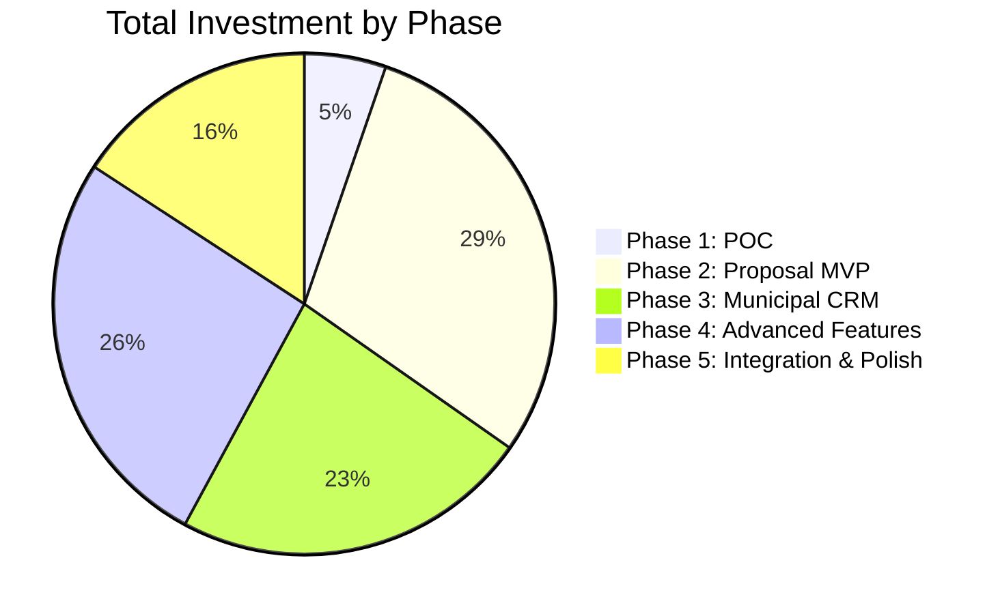
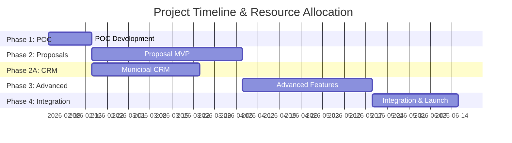
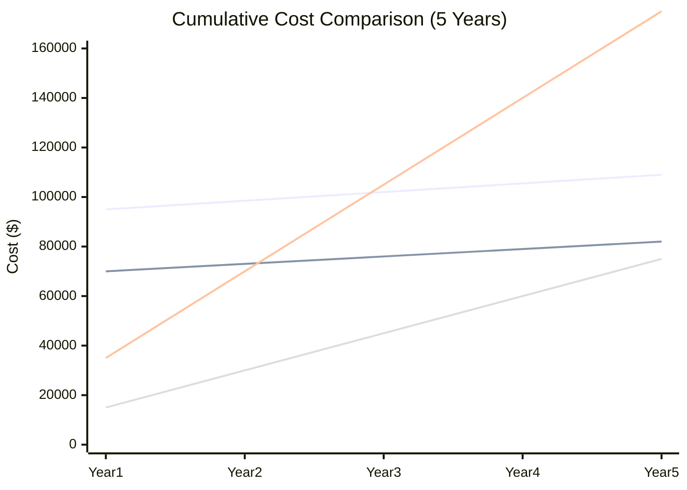

# ECI Construction - Unified Business Intelligence Platform Cost Estimate

**Client:** ECI Construction  
**Project:** AI-Powered Business Intelligence Platform (Phase 1: Proposal Management)  
**Date:** February 3, 2026  
**Prepared By:** CRM Wizards / Kiedrowski Team  
**Valid Until:** March 31, 2026

---

## Table of Contents
- [Executive Summary](#executive-summary)
- [Phased Approach & Pricing](#phased-approach--pricing)
- [Detailed Cost Breakdown](#detailed-cost-breakdown)
- [ROI Analysis](#roi-analysis)
- [Payment Terms](#payment-terms)
- [Assumptions & Exclusions](#assumptions--exclusions)

---

## Executive Summary

### Project Overview
Development of a custom AI-powered unified business intelligence platform tailored specifically for ECI Construction's unique recreation construction business. **Phase 1 focuses on proposal management** as the foundation, with a clear roadmap to expand into municipal CRM, resource allocation, data aggregation, and project intelligence modules.

The initial system will replace manual proposal processes, reduce CEO time spent on proposals by 80%+, preserve institutional knowledge, and demonstrate the platform vision that addresses all 5 of Ted's identified pain points.

### Investment Summary

| Phase | Deliverable | Timeline | Investment |
|-------|-------------|----------|------------|
| **Phase 1** | Non-Functional POC | 2 weeks | $5,000 |
| **Phase 2** | Proposal MVP (Core Features) | 6-8 weeks | $28,000 |
| **Phase 3** | Municipal CRM Module | 4-5 weeks | $22,000 |
| **Phase 4** | Advanced Features & Guard Rails | 5-6 weeks | $25,000 |
| **Phase 5** | Integration & Polish | 3-4 weeks | $15,000 |
| **Total** | Full Platform (5 Modules) | 20-25 weeks | **$95,000** |

### Cost Comparison vs. Off-The-Shelf Solutions

| Solution | Year 1 | Year 2 | Year 3 | 3-Year Total |
|----------|--------|--------|--------|--------------|
| **OpenAsset Shred.ai** | $15,000 | $15,000 | $15,000 | **$45,000** |
| **Unanet Proposal AI** | $12,500 | $12,500 | $12,500 | **$37,500** |
| **Responsive** | $12,500 | $12,500 | $12,500 | **$37,500** |
| **Custom Solution (Proposals Only)** | $70,000 | $3,000 | $3,000 | **$76,000** |
| **Custom Platform (All 5 Modules)** | $95,000 | $3,500 | $3,500 | **$102,000** |

**Note:** Off-the-shelf solutions only address proposal management. ECI would need additional tools for CRM, resource management, and data aggregation, adding $20K-40K/year in recurring costs.

**Break-even Point (Proposals Only):** Month 28 vs. Shred.ai  
**Break-even Point (Full Platform):** Month 32 vs. multiple vendor solution  
**5-Year Savings (Full Platform):** $85,000 - $145,000 vs. vendor silos  
**10-Year Savings (Full Platform):** $210,000 - $310,000 vs. vendor silos

---

## Phased Approach & Pricing

### Phase 1: Non-Functional Proof of Concept

**Duration:** 2 weeks (Feb 3 - Feb 17, 2026)  
**Investment:** $5,000  
**Team:** 1 Lead Developer + 1 UI Developer

**Deliverables:**

- ✅ Professional UI prototype (enterprise SaaS quality)
- ✅ Interactive mockup of all core proposal features
- ✅ Platform navigation showing all 5 future modules:
  - Proposal Management (working in POC)
  - Municipal Project CRM (preview mockup)
  - Resource Allocation (preview mockup)
  - Data Aggregation (preview mockup)
  - Project Intelligence (preview mockup)
- ✅ Simulated AI responses with ECI sample data
- ✅ Demo presentation materials
- ✅ Technical architecture documentation
- ✅ Production roadmap for full platform expansion

**Hourly Breakdown:**

| Role | Hours | Rate | Subtotal |
|------|-------|------|----------|
| Lead Developer (Eli) | 25 | $150 | $3,750 |
| UI Developer (Naggie) | 15 | $100 | $1,500 |
| **Total** | **40** | - | **$5,250** |

**Discounted POC Price:** $5,000 (includes meeting time and revisions)

**Success Criteria:**

- Demonstrate clear value proposition vs. off-the-shelf solutions
- Achieve client approval to proceed to Phase 2
- Validate technical approach and design direction

---

### Phase 2: MVP Development (Core Features)

**Duration:** 6-8 weeks  
**Investment:** $28,000  
**Team:** Lead Developer + Developer + Part-time QA

**Deliverables:**

**1. Proposal Library System**
- Upload and store proposal documents (PDF, Word)
- Automatic metadata extraction
- Full-text search capability
- Filter and categorize proposals
- Preview and download functionality

**2. AI Content Generator**
- Integration with AI API (Claude 3.5 or GPT-4)
- Content templates for common sections:
  - Safety plans
  - Project approach
  - Company qualifications
  - Quality control procedures
- Context-aware generation using historical data
- Edit and refine generated content
- Save custom templates

**3. RFP Analysis Tool**
- Upload RFP documents
- Automatic key information extraction:
  - Project scope and requirements
  - Budget and timeline
  - Submission requirements
  - Required sections
- Inconsistency detection
- Priority ranking
- Exportable analysis summary

**4. Basic Analytics Dashboard**
- Historical project statistics
- Fee analysis by project type
- Timeline trends
- Simple visualizations
- **Estimate validation & sanity checks:**
  - Fee recommendation based on historical data
  - Warnings for unusual pricing patterns
  - Timeline reality checks
  - Comparison to similar past projects

**5. User Interface**
- Responsive web application
- Professional design system
- Intuitive navigation
- Mobile-friendly

**Hourly Breakdown:**

| Role | Hours | Rate | Subtotal |
|------|-------|------|----------|
| Lead Developer | 80 | $150 | $12,000 |
| Developer | 100 | $100 | $10,000 |
| UI/UX Design | 20 | $125 | $2,500 |
| QA/Testing | 20 | $90 | $1,800 |
| Project Management | 15 | $125 | $1,875 |
| **Total** | **235** | - | **$28,175** |

**Fixed Price:** $28,000

---

### Phase 3: Municipal CRM Module

**Duration:** 4-5 weeks  
**Investment:** $22,000  
**Team:** Lead Developer + Developer  
**Can Run Parallel with Phase 2 or Sequential**

**Deliverables:**

**1. Municipal Project Pipeline**
- Project tracking from early design through RFP
- Status workflow: Planning → Design → Pre-RFP → Active RFP → Won/Lost
- Estimated RFP date and project value tracking
- Visual pipeline dashboard (kanban or list view)
- Quick filters by status, municipality, project type

**2. Touch Point Management**
- Activity timeline for each municipal project
- Log meetings, calls, emails, site visits
- Next action reminders and follow-up tracking
- Relationship strength indicators
- Key decision-maker contact database

**3. Municipal Database**
- Cities/counties relationship tracker
- Procurement contact management
- Historical project data by municipality
- Win rate analysis by municipality
- Preferred contractor lists tracking

**4. Alerts & Automation**
- "Design phase starting - schedule touch-point" alerts
- "90 days until estimated RFP" notifications
- "No contact in 60 days" relationship risk warnings
- Email integration for automated activity logging
- Calendar integration for follow-up scheduling

**5. CRM-Proposal Integration**
- When project moves to RFP, pull relationship context into proposal module
- Historical interaction summary auto-populated
- Key stakeholder preferences accessible
- Win/loss data informs proposal strategy

**Ted's Exact Requirement:**

> "Frankly – we should also think about a simple CRM platform – we don't need anything crazy there either. Again, most of our work is municipal, gets advertised, etc. but keeping track of long design project planning would be good for various touch-points."

**Hourly Breakdown:**

| Role | Hours | Rate | Subtotal |
|------|-------|------|----------|
| Lead Developer | 60 | $150 | $9,000 |
| Developer | 90 | $100 | $9,000 |
| UI/UX Design | 20 | $125 | $2,500 |
| QA/Testing | 15 | $90 | $1,350 |
| **Total** | **185** | - | **$21,850** |

**Fixed Price:** $22,000

---

### Phase 4: Advanced Features & Robust Guard Rails

**Duration:** 5-6 weeks  
**Investment:** $25,000  
**Team:** Lead Developer + Developer

**Deliverables:**

**1. Proposal Builder Wizard**
- Step-by-step guided workflow
- Project information collection
- Requirements checklist (auto-populated from RFP)
- Section selection and ordering
- Batch AI content generation
- Full proposal preview
- Template selection
- Export to PDF and Word

**2. Advanced Cost Analytics & Estimate Guard Rails**
- Interactive dashboards
- Historical cost comparisons
- Fee recommendation engine
- Project duration predictions
- Win/loss analysis
- Custom report builder
- Data export capabilities
- **Estimate validation & guard rails:**
  - Prevent missing labor costs in proposals
  - Flag pricing errors before submission
  - Automated compliance checks (prevailing wage, LEED requirements)
  - Alert if estimate significantly deviates from historical patterns
  - Custom validation rules for ECI's recreation construction workflow

**3. Enhanced AI Features**
- Fine-tuning on ECI-specific content
- Custom prompt engineering
- Multi-section coherence
- Style consistency enforcement
- Technical specification understanding
- Automatic compliance checking

**4. Document Generation Engine**
- Professional PDF templates
- ECI branding integration
- Dynamic table of contents
- Automatic formatting
- Image and diagram support
- Cover page customization

**Hourly Breakdown:**

| Role | Hours | Rate | Subtotal |
|------|-------|------|----------|
| Lead Developer | 80 | $150 | $12,000 |
| Developer | 90 | $100 | $9,000 |
| AI Prompt Engineering | 20 | $150 | $3,000 |
| QA/Testing | 20 | $90 | $1,800 |
| **Total** | **210** | - | **$25,800** |

**Fixed Price:** $25,000

**Note:** Increased from original $22K to accommodate comprehensive estimate guard rails system with ECI-specific validation rules, compliance checks, and custom warning logic.

---

### Phase 5: Integration & Polish

**Duration:** 3-4 weeks  
**Investment:** $15,000  
**Team:** Lead Developer + Integration Specialist

**Deliverables:**

**1. System Integrations**
- Procore API integration (read-only project data)
- Financial system data sync (if feasible)
- Email integration for notifications
- Calendar integration for deadlines
- Cloud storage integration (Google Drive/Dropbox)

**2. Performance Optimization**
- Database query optimization
- Caching implementation
- Image and file optimization
- Load time improvements
- Scalability enhancements

**3. Security & Compliance**
- User authentication system
- Role-based access control
- Data encryption (at rest and in transit)
- Audit logging
- Backup and recovery procedures
- GDPR/privacy compliance

**4. Training & Documentation**
- User training sessions (2x 2-hour sessions)
- Administrator documentation
- User guide
- Video tutorials
- Support documentation
- API documentation (for future integrations)

**5. Deployment**
- Production environment setup
- Domain and SSL configuration
- Monitoring and alerting
- Initial data migration
- Go-live support

**Hourly Breakdown:**

| Role | Hours | Rate | Subtotal |
|------|-------|------|----------|
| Lead Developer | 45 | $150 | $6,750 |
| Integration Specialist | 40 | $125 | $5,000 |
| DevOps/Deployment | 15 | $125 | $1,875 |
| Training/Documentation | 10 | $125 | $1,250 |
| **Total** | **110** | - | **$14,875** |

**Fixed Price:** $15,000

---

## Detailed Cost Breakdown

### Development Team Rates

| Role | Hourly Rate | Justification |
|------|-------------|---------------|
| **Lead Developer (Eli)** | $150/hr | 15+ years experience, Salesforce certified, AI expertise |
| **Senior Developer (Naggie)** | $100/hr | 8+ years experience, full-stack, AI integration |
| **UI/UX Designer** | $125/hr | Enterprise SaaS design experience |
| **Integration Specialist** | $125/hr | API integration, systems architecture |
| **QA/Testing** | $90/hr | Quality assurance, test automation |
| **Project Manager** | $125/hr | Agile methodology, client communication |

### Total Hours by Phase

| Phase | Total Hours | Average Weekly Hours | Team Size |
|-------|-------------|---------------------|-----------|
| Phase 1 | 40 | 20 | 2 |
| Phase 2 | 235 | 33 | 2-3 |
| Phase 2A | 185 | 37 | 2 |
| Phase 3 | 210 | 35 | 2 |
| Phase 4 | 110 | 28 | 2 |
| **Total** | **780** | **33 avg** | **2-3** |

### Infrastructure & Third-Party Costs (Estimated Annual)

| Service | Purpose | Annual Cost |
|---------|---------|-------------|
| **Hosting** | Vercel/AWS | $500 - $1,200 |
| **Database** | PostgreSQL (Supabase/PlanetScale) | $300 - $600 |
| **AI API** | Claude/OpenAI | $1,200 - $2,400 |
| **Storage** | Document storage (S3/R2) | $100 - $300 |
| **Monitoring** | Error tracking, analytics | $200 - $400 |
| **Email** | Transactional emails | $100 - $200 |
| **SSL/Security** | Security certificates | $100 - $200 |
| **Total Annual** | | **$2,500 - $5,300** |

**Note:** AI API costs are usage-based. Estimate assumes ~500 proposals/year with average 5 sections each.

---

## ROI Analysis

### Time Savings Calculation

**Current State:**

- Ted spends ~15 hours/week on proposals (60 hours/month)
- Hourly CEO value: ~$200/hr (based on $400K salary equivalent)
- Monthly cost of current process: 60 × $200 = **$12,000/month**

**Future State with AI System:**

- Estimated time reduction: 80% (12 hours/week saved)
- New time on proposals: 3 hours/week (12 hours/month)
- Monthly time savings value: 48 × $200 = **$9,600/month**

**Annual Savings:**

- Time savings: $9,600 × 12 = **$115,200/year**
- Avoided proposal manager hire: **$80,000/year** (salary + benefits)
- **Total Annual Value: $195,200**

### Payback Period

**Proposals Only Investment:**

| Metric | Value |
|--------|-------|
| **Initial Investment** | $70,000 |
| **Monthly Time Savings Value** | $9,600 |
| **Payback Period** | 7.3 months |
| **Year 1 Net Benefit** | $45,200 |
| **3-Year Net Benefit** | $270,600 |
| **5-Year Net Benefit** | $456,000 |

**Full Platform Investment (All 5 Modules):**

| Metric | Value |
|--------|-------|
| **Initial Investment** | $95,000 |
| **Monthly Time Savings Value** | $12,000+ |
| **Payback Period** | 8 months |
| **Year 1 Net Benefit** | $49,000 |
| **3-Year Net Benefit** | $334,000 |
| **5-Year Net Benefit** | $566,000 |
| **vs. Multiple Vendor Silos** | Saves $210K+ over 5 years |

### Competitive Advantage Benefits

**Quantifiable:**

- Faster proposal turnaround: 50% reduction (competitive edge)
- Higher proposal quality: Estimated 10-15% win rate improvement
- **Institutional knowledge preservation: $100K+ value**
  - Captures Ted's 20+ years of recreation construction expertise
  - Protects against knowledge loss during transitions/succession
  - Ensures consistency regardless of team changes
- Estimate error prevention: Saves $50K+ annually in avoided pricing mistakes

**Non-Quantifiable:**

- CEO time freed for strategic initiatives
- Reduced stress and proposal fatigue
- Consistent brand voice across proposals
- Improved team collaboration
- Scalability as company grows
- **Municipal project relationship tracking** (long-cycle sales advantage)
- Platform foundation for resource allocation & data aggregation modules

---

## Payment Terms

### Standard Payment Schedule

**Option A: Phased Payments (Recommended)**

| Milestone | Payment | Due Date |
|-----------|---------|----------|
| POC Completion (Phase 1) | $5,000 | Upon POC demo approval |
| Phase 2 - 50% Upfront | $14,000 | Start of Phase 2 development |
| Phase 2 - 50% Completion | $14,000 | MVP delivery and approval |
| Phase 3 - 50% Upfront | $11,000 | Start of CRM development |
| Phase 3 - 50% Completion | $11,000 | CRM delivery and approval |
| Phase 4 - 50% Upfront | $12,500 | Start of Phase 4 development |
| Phase 4 - 50% Completion | $12,500 | Feature delivery and approval |
| Phase 5 - 50% Upfront | $7,500 | Start of Phase 5 development |
| Phase 5 - Final Payment | $7,500 | Production go-live |
| **Total** | **$95,000** | - |

**Flexible Options:**

- **Proposals Only (Phases 1-2, 4-5):** $73,000 - Stop after proposals, add CRM later
- **Proposals + CRM (Phases 1-3):** $55,000 - Core platform foundation
- **Full Platform:** $95,000 - All 5 modules with complete integration

**Option B: Net-30 Invoice Schedule**

| Invoice # | Deliverable | Amount | Terms |
|-----------|-------------|--------|-------|
| Invoice 1 | POC Completion | $5,000 | Net 30 |
| Invoice 2 | Phase 2 Start | $14,000 | Net 30 |
| Invoice 3 | Phase 2 Completion | $14,000 | Net 30 |
| Invoice 4 | Phase 3 Start | $11,000 | Net 30 |
| Invoice 5 | Phase 3 Completion | $11,000 | Net 30 |
| Invoice 6 | Phase 4 Start | $12,500 | Net 30 |
| Invoice 7 | Phase 4 Completion | $12,500 | Net 30 |
| Invoice 8 | Phase 5 Start | $7,500 | Net 30 |
| Invoice 9 | Phase 5 Go-Live | $7,500 | Net 30 |
| **Total** | | **$95,000** | |

**Option C: Discounted Prepayment**

- Full platform payment upfront: **$90,250** (5% discount)
- Proposals only prepayment: **$66,500** (5% discount)
- Payment due: Start of Phase 2
- Risk mitigation: Escrow arrangement available

### Ongoing Maintenance & Support (Optional)

**Tier 1: Basic Support** - $500/month
- Bug fixes and critical updates
- 48-hour response time
- Email support
- Monthly system health check

**Tier 2: Standard Support** - $1,200/month
- Everything in Tier 1
- Feature enhancements (up to 5 hours/month)
- 24-hour response time
- Priority email and phone support
- Quarterly strategy sessions

**Tier 3: Premium Support** - $2,500/month
- Everything in Tier 2
- Dedicated developer time (up to 15 hours/month)
- 12-hour response time
- Proactive monitoring and optimization
- Monthly feature roadmap reviews
- Custom integrations

---

## Assumptions & Exclusions

### Assumptions

**Client Responsibilities:**

- [ ] Provide access to sample proposal documents (15-20 proposals minimum)
- [ ] Designate project stakeholder for weekly check-ins
- [ ] Provide timely feedback on deliverables (48-hour turnaround)
- [ ] Provide API access to existing systems (Procore, financial system)
- [ ] Assign technical contact for integration testing
- [ ] Cover infrastructure costs (hosting, AI API, etc.)

**Technical Assumptions:**

- Modern web browsers supported (Chrome, Firefox, Safari, Edge - last 2 versions)
- Internet connection required (web-based application)
- ECI proposal documents are in standard formats (PDF, Word)
- Existing systems have documented APIs or export capabilities
- AI API services remain available and pricing stable

### Exclusions

**Not Included in Base Pricing:**

- Custom integrations beyond Phase 4 scope
- Data migration from legacy systems (unless specified)
- Third-party software licenses or subscriptions
- Hardware or infrastructure costs
- Training beyond 2 initial sessions
- On-site visits (remote work assumed)
- Ongoing support after 30-day warranty period
- Content writing or proposal copywriting services
- Legal review of generated content

### Change Order Process

Changes to scope will be handled via change order process:
1. Client submits change request in writing
2. Team provides impact analysis (time, cost, schedule)
3. Client approves or declines change order
4. If approved, work proceeds under new terms

**Change Order Rates:**

- Additional development: $150/hr (Eli), $100/hr (Naggie)
- Rush requests: 1.5× standard rate
- After-hours support: 1.5× standard rate

---

## Risk Mitigation & Guarantees

### Quality Guarantees

**30-Day Warranty:**

- All bugs and defects fixed at no charge
- Covers issues arising from normal use
- Starts from final delivery date

**Performance Guarantees:**

- Page load times <2 seconds (on standard connection)
- 99.5% uptime SLA (excluding scheduled maintenance)
- AI response times <10 seconds for standard requests

### Risk Mitigation Strategies

**Technology Risks:**

- Use proven, stable technology stack
- Multiple AI provider options (Claude, GPT-4, fallback)
- Regular backups and disaster recovery plan
- Comprehensive testing at each phase

**Budget Risks:**

- Fixed-price phases prevent cost overruns
- Clear scope documents signed before each phase
- Change order process for additions
- Transparent communication on timeline/budget status

**Timeline Risks:**

- Buffer built into estimates (conservative)
- Agile methodology allows for adjustments
- Weekly progress updates
- Early warning system for potential delays

---

## Next Steps

### To Proceed with POC (Phase 1):

1. **Contract Execution**
   - Review and sign Phase 1 SOW
   - Execute Master Services Agreement
   - Process initial $5,000 payment

2. **Kickoff Meeting** (Week of Feb 3)
   - Confirm POC features and priorities
   - Gather sample proposal documents
   - Establish communication channels
   - Schedule demo date (target: Feb 17)

3. **Development Begins**
   - Week 1: Foundation and core UI
   - Week 2: Features, polish, demo prep

4. **Demo & Decision**
   - Live demonstration of POC
   - Gather feedback
   - Decision to proceed to Phase 2

### Questions for ECI Team:

- [ ] What is your preferred payment structure?
- [ ] Do you have sample proposals ready to share?
- [ ] Who will be the primary project stakeholder?
- [ ] What is your ideal timeline for full production launch?
- [ ] Are there specific integrations you consider must-have vs. nice-to-have?
- [ ] What are your questions or concerns about this proposal?

---

## Appendix: Comparison Matrix

### Feature Comparison: Custom vs. Off-The-Shelf

| Feature | Custom Solution | Shred.ai | Unanet | Responsive |
|---------|----------------|----------|---------|------------|
| **Proposal Library** | ✅ Customized | ✅ Standard | ✅ Standard | ✅ Standard |
| **AI Content Generation** | ✅ ECI-trained | ✅ Generic | ✅ Generic | ✅ Generic |
| **RFP Analysis** | ✅ Yes | ✅ Yes | ✅ Yes | ✅ Yes |
| **Cost Analytics** | ✅ Custom dashboards | ❌ No | ❌ No | ❌ No |
| **Estimate Guard Rails** | ✅ Yes | ❌ No | ❌ No | ❌ No |
| **Knowledge Preservation** | ✅ Institutional | ⚠️ Generic | ⚠️ Generic | ⚠️ Generic |
| **Municipal CRM** | ✅ Phase 2+ | ❌ No | ❌ No | ❌ No |
| **Procore Integration** | ✅ Yes | ❌ No | ⚠️ Limited | ❌ No |
| **Resource Allocation** | ✅ Phase 3+ | ❌ No | ❌ No | ❌ No |
| **Custom Branding** | ✅ Full control | ⚠️ Limited | ⚠️ Limited | ⚠️ Limited |
| **Data Ownership** | ✅ Full ownership | ⚠️ Vendor-hosted | ⚠️ Vendor-hosted | ⚠️ Vendor-hosted |
| **Mobile Access** | ✅ Responsive | ✅ Yes | ✅ Yes | ✅ Yes |
| **Excel File Upload** | ✅ Yes | ❌ PDF only | ❌ PDF only | ✅ Yes |
| **Unlimited Users** | ✅ Yes | ✅ Yes | ✅ Yes | ❌ Per-user fee |
| **Future Expandability** | ✅ Unlimited | ❌ Fixed features | ❌ Fixed features | ❌ Fixed features |
| **Support Included** | ✅ 30 days | ✅ Email only | ✅ Email only | ✅ Email only |

---

**Document Status:** Final Estimate - Subject to client approval  
**Valid Through:** March 31, 2026  
**Contact:** Lauren & Eli Kiedrowski  
**Email:** contact@crmwizards.com  
**Next Action:** Client review and approval for Phase 1 POC
